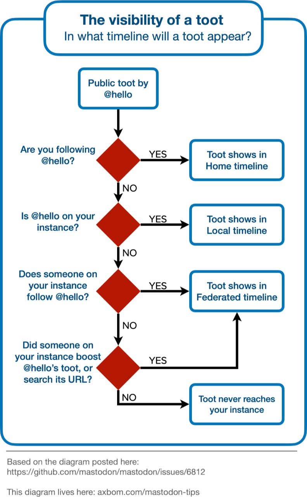

# Community

Hachyderm Community Resources, including:

* Troubleshooting, Support, and Issues 
a.k.a. How to get help when you need it
* [Mastodon 101](#mastodon-101) General new-to-Mastodon tips and tricks.

# Mastodon 101

Hello Hachydermians! Some of you are new to Mastodon, so here are some notes to help you get started. Since a fair few of you are coming from Twitter, there will be comparisions to the Twitter model for social media.

## How do I sign up?

If you're looking to sign up with us here at Hachyderm, you can sign up on [hachyderm.io](https://hachyderm.io). The only criteria for signing up is abiding by our [Hachyderm Terms of Service](https://hachyderm.io/about/more). If you're looking at other Mastodon instances, then the sign up process is likely similar but with their own domain and Terms of Service.

## Troubleshooting, Support, and Issues

The most critical thing you can do to help us help you (even more so than a donation) is to **reduce noise**. 

The best way for you to help reduce noise is to leverage our issue tracker instead of independent one-off requests for help. It is a full time job sifting through requests and making sense of them. If you want to help, leverage the issue tracker and [create a new issue](https://github.com/hachyderm/community/issues/new) or better yet find one that already exists.

### Do Not

 - Please do not reach out on Twitter.
 - Please do not join the Discord just to report an issue, bug, or feature request.
 - Please do not send us emails (we get too many emails).
 
### Do
 
  - File an issue in this repository

# Respectful Tooting

## How do I access (public) toots?

There are a few different ways:

* The web browser, so in our case [hachyderm.io](https://hachyderm.io)
* A client app, usually for mobile devices:
  * iOS: [Toot!](https://apps.apple.com/us/app/toot/id1229021451) (cost: $4 USD)
  * Android: [Tusky](https://play.google.com/store/apps/details?id=com.keylesspalace.tusky&hl=en_US&gl=US&pli=1) (cost: free)

For a complete comparison of 8 iOS apps: Fedi, Mast, Mastodon (official), Mercury, Metatext, tooot, Toot!, and Tootle, please take a look at [Transpondering's Blog](https://transponderings.blog/2022/05/21/eight-mastodon-apps-for-iphone/) on the topic. The deep dive is very deep, going into various UI features, commenting about how intuitive the different apps are or aren't, which are more or less compatible with screenreaders and VoiceOver, and so on.

## Who can see my stuff / Whose stuff can I see?

This diagram has been making rounds on Twitter, Mastdon, et al. It is from a GitHub issue on the Mastodon project:

This is the case of _public_ toots only. When you are a private account, the people you allow to follow you are the people who can see your toots.

### Who can see DMs? It depends.

Direct messages allow you to communicate with one or more other users. This is similar to what you've likely seen on other platforms like Slack/Discord and Twitter with a notable exception:

* ⚠️ **_When you bring someone into a DM conversation they are able to see the whole DM history._**

On the one hand this solves the problem of Slack and similar where when you add someone to a conversation you need to summarize everything relevant to that point to bring the new person / people up to speed. That said, if you aren't expecting it, it can expose conversations to third parties that needed to be private.

The other person / people who can see DMs are mods. 

* **_Yes, mods_ can _see your DMs._**

Similar to the above, this is a double edged sword. On the one hand it makes it easy for mods to read DMs when they receive a report of harassing behavior. On the other hand it might also make private conversations visible that you wished were kept private even in those circumstances.

<u>As a transparent statement</u>: Hachyderm mods do _not_ casually read user DMs. We would only look at a specific DM in the event of a report from a user (e.g. due to harassment, platform errors, etc.). We spend all of our cycles running production, so :) 

### DM user experience in the various interfaces

The UI experience of DMs is not as clearly separated as other apps like Twitter, Slack/Discord, et al. In the web UI, for example, DMs do not look significantly different than a private account tooting in your feed. Some of the mobile apps, like Toot!, have a better visual separation. Basically: depending on where you prefer to toot, you'll have vastly different experiences (for now).

## Content Warnings ⛔️

Content Warnings are implemented differently in Mastodon than Twitter. CW'ed toots look like this:

In this case the toot has both text and associated graphic. You would need to click to display each separately in each case. When a toot has a CW, all toots in the conversation carry that same CW.

Content Warnings have a few uses:

* If discussing topics that can cause distress or trigger PTSD, like a great many political situations
* Discussing topics that will spoil a book / movie / show

**_Because of how well CWs are implemented on the platform, we recommend that people make use of them._** It is far easier on the mental health of other users to opt into a discussion about Whatever than to skim past it.

Also! Make sure that your CWs are _specific_ so users know whether they want to opt in or not. e.g. are you hiding a toot / image that depicts violence or hints at it? Are you hiding the season finale to a show? How users socialize their use of CWs is what makes them useful. Making heavy, unclear, use of CWs adds confusion.

## Hashtags will help others see your toots

If you've tried to use the search function you've likely noticed that you cannot use it _quite_ the same way as Twitter. You cannot search for a term and find everyone writing about that word on your own or federated servers. What _does_ show up are people and hashtags. You can take this information and do with it what you will :) We do not recommend adding so many hashtags to your toots that they are unreadable though.

<u>Accessibility Awareness</u>: when you camel case your hashtags (CamelCase) then screenreaders can successfully read the text, but when you use all same case (likethis or LIKETHIS) then they cannot. So if you're going to use hashtags, please remember to \#UseCamelCase.

## Tooting Videos 

Although you can upload videos to toot, we recommend linking to a third party service like Vimeo, TikTok, et al.

## Emojis 👍

Ok, so different instances have different emoji. Which emoji can you and others see? Which can you use?

The emoji that are provided via your instance of Mastodon are the emoji set you can use. You can use the Emojos app to see what emoji are available for you to use. For example, the Hachyderm set is visible via [emojos.in/hachyderm.io](https://emojos.in/hachyderm.io).

Mastodon will render emojis in use on other instances in your feed correctly. Likewise users on other instances will see the special emoji you use here on Hachyderm correctly, even if they do not have them on their own, separate, instance.

## Who's Who? 

Let's say you formerly interacted with only a few people but found yourself recently, ah, interacting with let's say many. Sometimes people's usernames reflect the names you know them as and sometimes they do not. Sometimes you follow new colleagues or people you've meet on or off line. If you would like, youc can add notes that only you see to a users profile. It can look something like this:

Not all mobile apps support editing this field at this time, so that is something to check if that interests you.

## Where to learn more stuff?

There is always the Mastodon documentation, as well as the [Fedi.Tips](https://mstdn.social/@feditips) account that posts updated tips on the regular.
