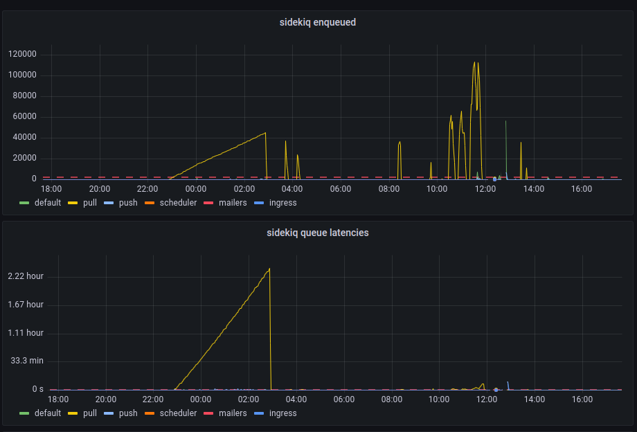

---
title: "Opening Hachyderm Registrations"
linkTitle: "Open Registrations"
date: 2022-12-04
author: Kris Nóva ([@krisnova](https://hachyderm.io/@nova))
description: >
  Update on the current state of Hachyderm user registrations.
---

Yesterday I made the decision to temporarily close user registrations for the main site: [hachyderm.io](https://hachyderm.io).

Today I am making the decision to re-open user registrations again for Hachyderm.

### Reason for Closing 

The primary reason for closing user registrations yesterday was related to the [DDoS Security Threat](https://hachyderm.io/@nova/109451616906969285) that occurred the morning after our [Leaving the Basement](https://community.hachyderm.io/blog/2022/12/03/leaving-the-basement/) migration.

The primary vector that was leveraging Hachyderm infrastructure for perceived malicious use, was creating spam/bot accounts on our system. 
Out of extreme precaution, we closed signups for roughly 24 hours,

### Reason for Opening

Today, Hachyderm does not have a targeted growth or capacity number in mind.

However, what we have observed is that user adoption as dropped substantially compared to November. 
In my opinion, I believe that we will see substantially less adoption in December than we did in November.

We will be watching closely to validate this hypothesis, and will leverage this announcement page as an official source of truth if our posture changes.

For now we have addressed some more detail on growth, registrations, and sustainability in our [Growth and Sustainability])(https://community.hachyderm.io/blog/2022/12/04/growth-and-sustainability/) blog.