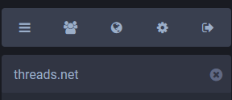
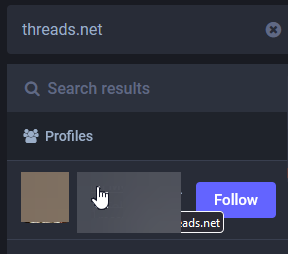
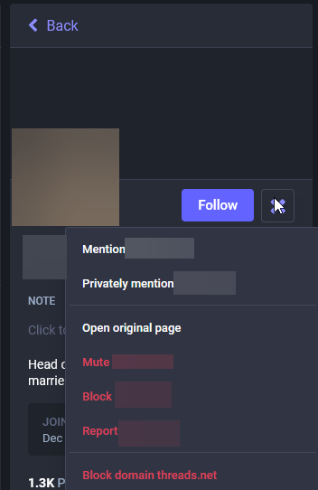
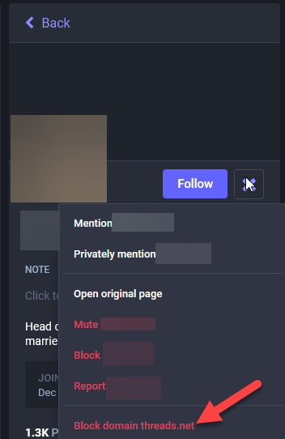
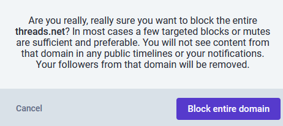

---
title: "Threads Update"
linkTitle: "Threads Update"
date: 2023-12-23
author: Hachyderm ([@hachyderm](https://hachyderm.io/@hachyderm))
description: >
  Update on the current state of Hachyderm's federation with Threads.
---

## What is Threads?

Threads is an online [social media](https://en.wikipedia.org/wiki/Social_media "Social media") and [social networking service](https://en.wikipedia.org/wiki/Social_networking_service "Social networking service")operated by [Meta Platforms](https://en.wikipedia.org/wiki/Meta_Platforms "Meta Platforms"). The app offers users the ability to post and share text, images, and videos, as well as interact with other users' posts through replies, [reposts](https://en.wikipedia.org/wiki/Reblogging "Reblogging"), and [likes](https://en.wikipedia.org/wiki/Like_button "Like button"). Closely linked to Meta platform [Instagram](https://en.wikipedia.org/wiki/Instagram "Instagram") and additionally requiring users to both have an Instagram account and use Threads under the same Instagram [handle](https://en.wikipedia.org/wiki/Mention_(blogging) "Mention (blogging)"), the functionality of Threads is similar to [X](https://en.wikipedia.org/wiki/Twitter "Twitter") (formerly known as Twitter)[1] and Mastodon.

## What is the status of their ActivityPub implementation?

As of December 13, 2023, Threads has begun to test their implementation of ActivityPub. As of December 22, 2023, only **seven** users from Threads are federating with Hachyderm’s instance. For all other users on Threads, we are seeing that the system is not federating correctly due to certificate errors on Threads side.  We understand that they are working to resolve those certification issues with assistance from the Mastodon core team.

Based on the available [Terms of Use](https://help.instagram.com/769983657850450) and [Supplemental Privacy Policy](https://help.instagram.com/515230437301944) provided by Meta, they are not selling any of the data they have. This is not official legal or privacy advice for individual users and we recommend evaluating the linked documents yourself to determine for yourselves.

With regards to the section in the privacy policy 
> Information From Third Party Services and Users: We collect information about the Third Party Services and Third Party Users who interact with Threads. If you interact with Threads through a Third Party Service (such as by following Threads users, interacting with Threads content, or by allowing Threads users to follow you or interact with your content), we collect information about your third-party account and profile (such as your username, profile picture, and the name and IP address of the Third Party Service on which you are registered), your content (such as when you allow Threads users to follow, like, reshare, or have mentions in your posts), and your interactions (such as when you follow, like, reshare, or have mentions in Threads posts).

It’s important to remember a few things:

- The Mastodon/ActivityPub at their core uses a form of caching of information in order to make the process as seamless as possible. For example, when you create a verified link on your profile, every instance that your profile opens on does its own checks of the links and saves the validation on that third party server. This helps prevent malicious actors from falsifying their verified links that would then trickle out to other instances.
- We don’t transmit user IP’s to any third party instances as part of your interaction. If Meta is able to collect your IP, it would be through a direct interaction with a post on their server or CDN. 

## How does this impact Hachyderm?

At this point, Threads tests of the ActivityPub do not impact us directly. Based on the available information, they haven’t breached any rules of this instance, they aren’t selling any of the data as discussed above, and the user pool is so limited that even if they did, our team's ability to moderate that would be quick and decisive. In addition any users that do want to block Threads at this time, can follow the instructions in the next section to pre-emptively block Threads at their account level.

As a result, we will continue to follow our standard of monitoring each instance on a case by case to see how the situation evolves, and if a time comes that we see Threads federations as a risk to the safety of our users and community, we will defederate at that time.

Indirectly, we know that admins of other instances have expressed that they will defederate with any instances that will continue to federate with Threads. While we hope that the information in this blog post has helped people understand the currently limited risk of continuing to federate with Threads, we also know that other instances have a much more limited set of resources and may need to preemptively defederate with the Threads instance. The beauty of the Fediverse is that each instance has that right and ability.

## How to block Threads.

1. Search for “threads.net” in the search box

2. Select a user from the results

3. Open the menu from the profile

4. Select “Block domain threads.net

5. Read the prompt and select your desired action

To understand the ramifications of blocking an instance, please review the [Mastodon documentation](https://docs.joinmastodon.org/user/moderating/#block-domain) for details on what happens.

## Next Steps

As Threads continues to implement their integration with ActivityPub and the Fediverse at large, we will watch how those users integrate with our community and how their service interacts with our servers. If you would like to learn more about our criteria for how Hachyderm handles federating with other instances, please review our [A Minute from the Moderators - July Edition](
https://community.hachyderm.io/blog/2023/07/07/a-minute-from-the-moderators/#how-hachyderm-handles-federating-with-other-instances) where we list out our criteria.

---

[1] https://en.wikipedia.org/wiki/Threads_(social_network)
