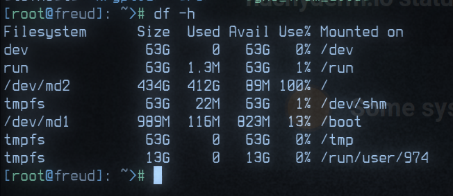

On Tuesday, December 13th, 2022 at roughly 18:52 UTC Hachyderm experienced a 7 minute cascading failure that has impacted our users around the globe resulting in unresponsive HTTP(s) requests and 5XX level requests. The service has not experienced any data loss. We believe this was a total service outage. 

Impacted users experienced 504 timeout responses from `https://hachyderm.io` in all regions of the world.

# Timeline 

All events are documented in [UTC](https://en.wikipedia.org/wiki/Coordinated_Universal_Time) time.

 - **18:53** `@nova` First report of slow response times in Discord
 - **18:55** `@dma` First confirmation, and first report of 5XX responses globally
 - **18:56** `@dma` Check of Mastodon web services, no immediate concerns
 - **18:56** `@nova` Check of CDN proxy services, no immediate concerns
 - **18:57** `@nova` First observed 504 timeout
 - **18:58** `@dma` [status.hachyderm.io](https://status.hachyderm.io) updated acknowledging the outage
 - **18:59** `@nova` First observed redis error, unable to persist to disk

```
Dec 13 18:59:01 fritz bundle[588687]: [2eae54f0-292d-488e-8fdd-5c35873676c0] Redis::CommandError (MISCONF Redis is configured to save RDB snapshots, but it's currently unable to persist to disk. Commands that may modify the data set are disabled, because this instance is configured to report errors during writes if RDB snapshotting fails (stop-writes-on-bgsave-error option). Please check the Redis logs for details about the RDB error.):
```

 - **19:01** `@UptimeRobot` First alert received

```
Monitor is DOWN: hachyderm streaming 
( https://hachyderm.io/api/v1/streaming/health ) - Reason: HTTP 502 - Bad Gateway
```

 - **19:02** `@nova` Root cause detected. The root filesystem is full on our primary database server.
 


- **19:04** `@nova` Identified postgres archive `/var/lib/postgres/archive` data exceeds 400Gb of history
- **19:05** `@malte_j` Request to destroy archive
- **19:06** `@malte_j` Confirmed archive has been destroyed
- **19:06** `@malte_j` Confirmed 187Gb of space has been recovered
- **19:06** `@dma` [status.hachyderm.io](https://status.hachyderm.io) updated acknowledging the root cause
- **19:07** `@nova` Begin drafting postmortem notes
- **19:16** `@nova` Official announcement posted to Hachyderm

# Root Cause

Full root filesystem on primary database server resulted in a cascading failure that first impacted Redis's ability to persist to disk which later resulted in 5XX responses on the edge.

### Things that went well

We had a place to organize, and folks on standby to respond to the incident.

We were able to respond and recover in less than 10 minutes.

We were able to document and more forward in less than 60 minutes.

### Things that went poorly

There was confusion about who had access to update `status.hachyderm.io` and this is still unclear.

There was confusion about where redis lived, and which systems where interdependent upon redis in the stack. 

The Novix installer is still our largest problem and is responsible for a lot of confusion. We do not have a better way forward to manage packages and configs in production. We need to decide on `Nix` and our path forward as soon as possible.

### Opportunities 

We need to harden our credential management process, and account management. We need to have access to our systems.

We need global architecture, ideally observed from the systems themselves and not in a diagram.

When an announcement is resolved, it removes the status entirely from UptimeRobot. We can likely improve this.

# Resulting Action

#### 1) Cron cleanup scheduled `@malte_j`

Cron scheduled to remove postgres archive greater than 5 days.

```bash 
#!/bin/bash
set -e

cd /var/lib/postgres/data/archive
find * -type f -mtime 5 -print0 | sort -z | tail -z -n 1 | xargs -r0 pg_archivecleanup /var/lib/postgres/data/archive
```

#### 2) Alerts configured `@dma`

Alerts scheduled for `>90%` filesystem storage on database nodes.

[Postmortem template](https://hackmd.io/9WtCp6MgQ_al1eKGvqAWkg) created for future incidents.

#### 3) Postmortem documented `@nova`

This blog post as well as a small discussion in Discord.