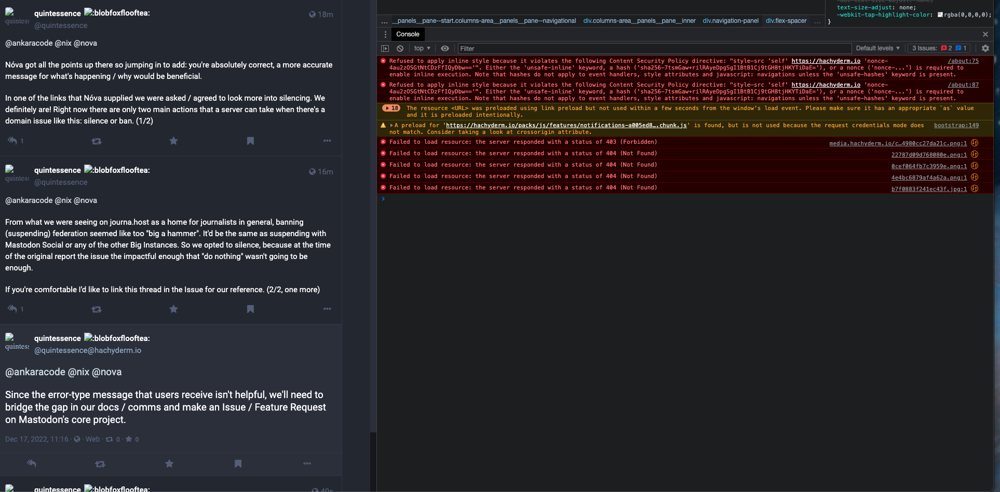
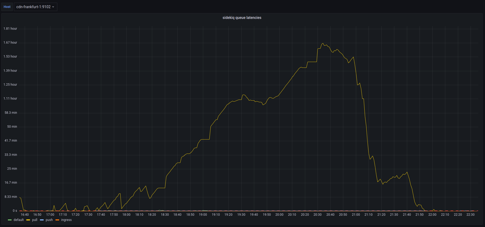
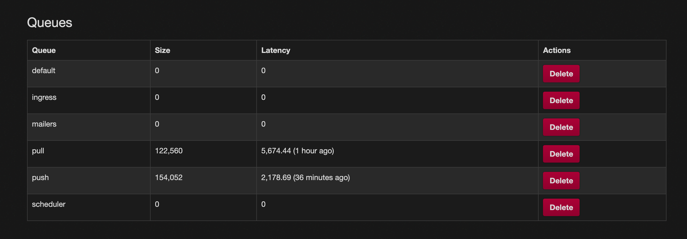
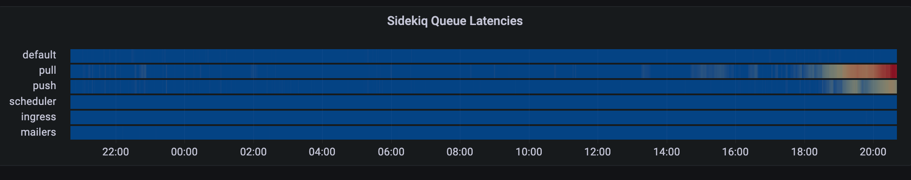

On Saturday, December 17th, 2022 at roughly 12:43 UTC Hachyderm received our [first report of media failures](https://github.com/hachyderm/community/issues/217) which started a 2-day-long investigation of our systems by `@hazelweakly`, `@quintessence`, `@dma`, and `@nova`. The investigation coincidentally overlapped with a well-anticipated spike in growth which also unexpectedly degraded our systems simultaneously.

The first degradation was unplanned media failures, typically in the form of avatar and profile icons intermittently on the service. We had an increase in 4XX level responses due to misconfigured cache settings in our CDN. We believe the Western US to be the only region impacted by this degradation. 



The second degradation was unplanned queue latency increasing presumably from the increase in usage due to the fallout of Twitter mass exodus. We experienced an increase in our `push` and `pull` queues, as well as a short period of `default` latency.  




# Timeline 

All events are documented in [UTC](https://en.wikipedia.org/wiki/Coordinated_Universal_Time) time.

 - Dec 16th **12:43** `@arjenpdevries` First report of media cache misses [#217](https://github.com/hachyderm/community/issues/217)
 - Dec 17th **08:21** `@blueturtleai ` 2nd Report, and first confirmation of media cache misses [#218](https://github.com/hachyderm/community/issues/218)
 - Dec 17th **21:43** `@quintessence` 3rd Report of media cache misses
 - Dec 17th **21:44** `@nova` False mediation of `cmd+shift+r` cache refresh
 - Dec 17th **22:XX** More reports of cache failures, multiple Discord channels, and posts
 - Dec 17th **23:XX** More reports of cache failures, multiple Discord channels, and posts
 - Dec 17th **24:XX** Still assuming "cache problems" will just fix themselves
 - Dec 18th **14:45** `@dma` Nginx audit and `location{}` rewrite on `fritz`; no results
 - Dec 18th **14:45** `@dma` No success debugging various CDN nodes and cache strategies
 - Dec 18th **15:16** `@dma` Check mastodon-web logs on CDNs; /system GETs with 404s
 - Dec 18th **20:32** `@hazelweakly` Discovered `.env.production` misconfiguration cdn-frankfurt-1, franz
 - Dec 18th **20:41** `@quintessence` Confirms queues are backing up





 - Dec 18th **20:45** `@hazelweakly` Confirms actively reloading services to drain queues
 - Dec 18th **21:17** `@malte_j` Appears from vacation, and is told to go back to relaxing
 - Dec 18th **21:23** `@hazelweakly` Continues to "tweak and tune" the queues
 - Dec 18th **21:32** `@hazelweakly` Claims we are growing at <1 user per minute
 - Dec 18th **21:45** `@dma` Reminder to only focus on `ingress` and `default` queues
 - Dec 18th **21:47** `@hazelweakly` Identifies queue priority fix using systemd units
 - Dec 18th **21:47** `@hazelweakly` Suggests moving queues to CDN nodes
 - Dec 18th **21:59** `@dma` Suggests migrating DB from `freud` -> `nietzsche`
 - Dec 18th **22:15** `@hazelweakly` Summary confirms sidekiq running on CDNs
 - Dec 18th **22:18** `@nova` Identifies conversation in Discord, and begins report

# Root Cause

The cause of the caching 4XX responses and broken avatars was a misconfigured `.env.production` file on `cdn-fremont-1` and `franz`.

```bash
S3_ENABLED=FALSE # Should be true
3_BUCKET=".."    # Should be S3_BUCKET
```

The cause of the queue latency is suspected to be the increase in usage from Twitter, as well as the queue priority documented [here in the official Mastodon scaling up documentation](https://docs.joinmastodon.org/admin/scaling/#sidekiq-queues).

```bash
ExecStart=/usr/bin/bundle exec sidekiq -c 10 -q default
```

### Things that went well

We have the cache media fixed, and we have been alerted to a high-risk concern early giving the team enough time to respond.

### Things that went poorly

An outage was never declared for this incident, and therefore it was not handled as well as it could have been.
Various members of the team were mutating production with reckless working habits

 - Documenting informally in private infrastructure GitHub repository
 - Discord used as documentation
 - No documenting just "tinkering" alone
 - Documenting after the fact
 - Not using descriptive language, EG: "Tweaked the CDNs" instead of changed <this file> on <this server> from <this value> to <that value>. 

Unknown state of production after the incident. Unsure which services are running where, and who has what expectations for which services. 

The configuration roll-out obviously had failed at some point, indicating a stronger need for config management on our servers.

We seemed to lose track of where the incident started and stopped and where improvements and action items began. For some reason we decided to make suggestions about next steps before we were entirely sure on the state of the systems today, and having a plan in place.

### Opportunities 

Config management should be a top priority.

Auditing and migrating sidekiq services off of CDN nodes should be a top priority.

Migrating the database from `freud` -> `nietzsche` should be a priority.

We shouldn't be planning or discussing future improvements until the systems are restored to stability. Incidents are not also a venue for decision-making.

# Resulting Action

#### 1) Plan for Postgres migration

`@nova` and `@hazelweakly` planning live stream to migrate production database and clear up more compute power for sidekiq queues

#### 2) TODO Configuration Management

We need to identify a configuration management pattern for our systems sooner than later. Perhaps an opportunity for a new volunteer.

#### 3) TODO Discord Bot Incident Command

We need to identify ways of managing and starting and stopping incidents using Discord. Maybe in the future we can have "live operating room" incidents where folks can watch read-only during the action.