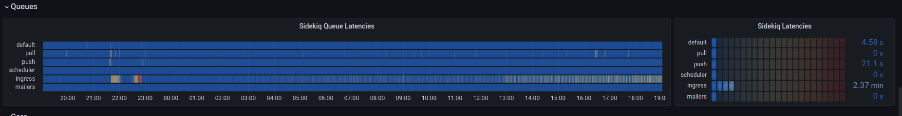
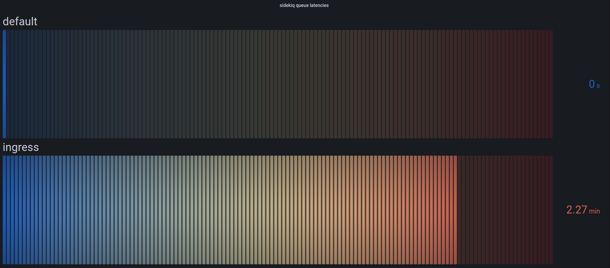
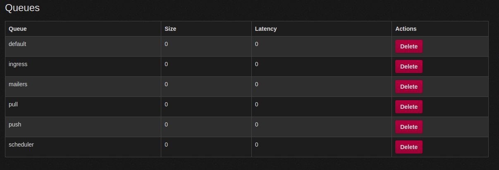

Every Queue down in Queueville liked ActivityPub a lot. 
But John Mastodon who lived just north of Queuville, did not!
John Mastodon hated ActivityPub, the whole Activity season!
Now please don't ask why. No one quite knows the reason.

It could be, perhaps, that his `WEB_CONCURRENCY` was too tight.
It could be his `MAX_THREADS` wasn't screwed on just right.
But I think that the most likely reason of all
May have been that his `CPU` was two sizes too small.

But, whatever the reason, his `WEB_CONCURRENCY` or `CPU`s,
He stood there on Activity Eve hating the Queues...
Staring down from his cave with systemd hacks
At the warm buzzing servers below in their racks

For he knew every Queue down in Queueville beneath
Was busy now hanging an Activity-Wreath.
"And they're posting their statuses," he snarled with a sneer.
"Tomorrow is Activity-Mas! It's practically here!"

Then he growled, with John Mastodon fingers nervously drumming,
"I must find some way to keep the statuses from coming"!

For, tomorrow, I know all the Queues and the "they"s and the "them"s
Will wake bright and early for ActivitySeason to begin!

And then! Oh, the noise! Oh, the noise! Noise! Noise! Noise!
There's one thing John Mastodon hates: All the NOISE! NOISE! NOISE! NOISE!

And they'll shriek squeaks and squeals, racing 'round on their hosts.
They'll update with jingtinglers tied onto their posts!
They'll toot their floofloovers. They'll tag their tartookas.
They'll share their whohoopers. They'll follow their #caturday-ookas.
They'll spin their #hashtags. They'll boost their slooslunkas.
They'll defederate their blumbloopas. But complain about their whowonkas.

And they'll play noisy games like post a cat on #caturday,
An ActivityPub type of all the queers and the gays!
And then they'll make ear-splitting noises galooks
On their great big postgres whocarnio ruby monolith flooks!

Then the Queues, young and old, will sit down to a feast.
And they'll feast! And they'll feast! And they'll FEAST! FEAST! FEAST! FEAST!



They'll feast on Queue-pudding, and rare Queue-roast-beast,
Ingress Queue roast beast is a feast I can't stand in the least!

And then they'll do something I hate most of all!
Every Queue down in Queueville, the tall and the small,

They'll stand close together, with UptimeRobot bells ringing.
They'll stand hand-in-hand, and those Queues will start singing!

And they'll sing! And they'll sing! And they'd SING! SING! SING! SING!
And the more John Mastodon thought of this Queue Activity Sing,
The more John Mastodon thought, "I must stop this whole thing!"

Why for fifty-three days I've put up with it now!
I must stop ActivityPub from coming! But how?

# Timeline 

All events are documented in [UTC](https://en.wikipedia.org/wiki/Coordinated_Universal_Time) time.

 - 13:00 `@dma` Noticed the ingress queue was backing up
 - 16:45 `@quintessence` Noticed the ingress queue was still lagging
 - 17:00 `@nova` Declared an incident
 - 17:30 `@hazelweakly` Noticed CPU at 100% on Freud and Franz
 - 17:34 `@hazelweakly` Worked with `@dma` to rebalance queues across Freud, Franz, and Nietzsche
 - 17:37 `@dma` Notices CPU on Nietzsche is not changing
 - 17:45 `@hazelweakly` Changes 5 `MAX_THREADS` to 20 `MAX_THREADS` on Nietzsche

# ActivityEve

"I know just what to do!" John Mastodon laughed in his throat.
"I'll max out the CPU, and cause the network to bloat."

And he chuckled, and clucked, "What a great John Mastodon trick!
With this CPU and network lag, I'll cause the latency to stick!"

"All I need is a denial of service." John Mastodon looked around.
But since denial of services are scarce, there was none to be found.

Did that stop John Mastodon? Hah! John Mastodon simply said,
"If I can't find a denial of service, I'll make one instead!"

So he took his dog `MAX`, and he took some more `EMPTY_THREADS`.
And he tied big `WEB_CONCURRENCY` on top of his head.
Then he loaded some cores and some old empty racks.
On a ramshackle sleigh and he whistled for `MAX`.

Then John Mastodon said "Giddyap!" and the sleigh started down
Toward the homes where the Queues lay a-snooze in their town.

All their graphs were dark. No one knew he was there.
All the Queues were all dreaming sweet dreams without care.
When he came to the first little house of the square.

"This is stop number one," John Mastodon hissed,
As he climbed up load average, empty cores in his fist.

Then he slid down the ingress, a rather tight bond.
But if a denial of service could do it, then so could John Mastodon.

The queues drained only once, for a minute or two.
Then he stuck his posts out in front of the ingress queue!

Where the little Queue messages hung all in a row.
"These messages," he grinched, "are the first things to go!"

Then he slithered and slunk, with a smile most unpleasant,
Around the whole server, and he took every message!

Cat pics, and updates, artwork, and birdsite plea's!
Holiday cheer, Hanukkah, Kwanza and holiday trees!

And he stuffed them in memory. John Mastodon very nimbly,
Stuffed all the posts, one by one, up the chimney.

Then he slunk to the default queues. He took the queues' feast!
He took the queue pudding! He took the roast beast!

He cleaned out that `/inbox` as quick as a flash.
Why, John Mastodon even took the last can of queue hash! 

Then he stuffed all the queues up the chimney with glee.
"Now," grinned John Mastodon, "I will stuff up the whole process tree!"

As John Mastodon took the process tree, as he started to shove,
He heard a small sound like the coo of a dove...

He turned around fast, and he saw a small Queue!
Little Cindy-Lou Queue, who was no more than two.

She stared at John Mastodon and said, "our statuses, why?
Why are you filling our queues? Why?"

But, you know, John Mastodon was so smart and so slick,
He thought up a lie, and he thought it up quick!

"Why, my sweet little tot," John Mastodon lied,
"There's a status on this `/inbox` that won't light on one side.

So I'm taking it home to my workshop, my dear.
I'll fix it up there, then I'll bring it back here."

And his fib fooled the child. Then he patted her head,
And he got her a drink, and he sent her to bed.

And when Cindy-Lou Queue was in bed with her cup,
He crupt to the chimney and stuffed the ingress queues up!

Then he went up the chimney himself, the old liar.
And the last thing he took was `/var/log` for their fire.
On their `.bash_history` he left nothing but hooks and some wire.

And the one speck of content that he left in the house
Was a crumb that was even too small for a mouse.

Then he did the same thing to the other Queues' houses,
Leaving crumbs much too small for the other Queues' mouses!

# Timeline

All events are documented in [UTC](https://en.wikipedia.org/wiki/Coordinated_Universal_Time) time.

- 17:58 `@dma` Notices we are no longer bottlenecked on Ingress after `@hazelweakly` makes changes
- 18:03 `@dma` Provides update on priority of systemd flags
- 18:10 `@dma` Provides spreadsheet for us to calculate connections to database

# ActivityMorn

It was quarter of dawn. All the Queues still a-bed,
All the Queues still a-snooze, when he packed up his sled,

Packed it up with their statuses, their posts, their wrappings,
Their posts and their hashtags, their trendings and trappings!

Ten thousand feet up, up the side of Mount Crumpet,
He rode with his load average to the tiptop to dump it!

"Pooh-pooh to the Queues!" he was John Msatodon humming.
"They're finding out now that no ActivityPub messages are coming!



They're just waking up! I know just what they'll do!
Their mouths will hang open a minute or two
Then the Queues down in Queueville will all cry boo-hoo!

That's a noise," grinned John Mastodon, "that I simply must hear!"
He paused, and John Mastodon put a hand to his ear.

And he did hear a sound rising over the snow.
It started in low, then it started to grow.

But this sound wasn't sad!
Why, this sound sounded glad!

Every Queue down in Queueville, the tall and the small,
Was singing without any ActivityPub messages at all!

He hadn't stopped ActivityPub messages from coming! They came!
Somehow or other, they came just the same!

And John Mastodon, with his feet ice-cold in the snow,
Stood puzzling and puzzling. "How could it be so?"

Posts came without #hashtags! It came without tags!
It came without content warnings or bags!

He puzzled and puzzled till his puzzler was sore.
Then John Mastodon thought of something he hadn't before.

Maybe ActivityPub, he thought, doesn't come from a database store.
Maybe ActivityPub, perhaps, means a little bit more!

And what happened then? Well, in Queueville they say
That John Mastodon's small heart grew three sizes that day!

And then the true meaning of ActivityPub came through,
And John Mastodon found the strength of ten John Mastodon's, plus two!

And now that his heart didn't feel quite so tight,
He whizzed with his load average through the bright morning light!

With a smile to his soul, he descended Mount Crumpet
Cheerily blowing "Queue! Queue!" aloud on his trumpet.

He road into Queuville. He brought back their joys.
He brought back their #caturday images to the Queue girls and boys!

He brought back their status and their pictures and tags,
Brought back their posts, their content and #hashtags.



He brought everything back, all the CPU for the feast!
And he, he himself, John Mastodon carved the roast beast!

Welcome ActivityPub. Bring your cheer,
Cheer to all Queues, far and near.

ActivityDay is in our grasp
So long as we have friends' statuses to grasp.

ActivityDay will always be
Just as long as we have we.

Welcome ActivityPub while we stand
Heart to heart and hand in hand.

# Timeline

All events are documented in [UTC](https://en.wikipedia.org/wiki/Coordinated_Universal_Time) time.

- 18:10 `@hazelweakly` Provides update that queues are now balancing and load is coming down
- 18:18 `@nova` Confirms queues are draining and systems are stabilizing 

# Root Cause 

John Mastodon took the queue hash, and up the chimney he stuck it.
The Hachyderm crew was too tired to fill out the report and said "fuck it".


```
Nietzsche:
- 4 default queues (unchanged)
- 32 default ingress (changed)

Franz:
- 6 default queues (unchanged)
- 1 ingress queue (changed)
- 5 pull queues (unchanged)
- 5 push queues (unchanged)

Freud:
- 3 default queues (unchanged)
- 2 ingress queues (changed)
- 2 pull queue (changed)
- 2 push queue (changed)

Changes:

Because the database connection count per ingress queue process changed, when necessary, I will clarify queue amounts in terms of database connections.

- Moved 2 ingress queues (40 DB connections) from franz to nietzsche
- Moved 2 ingress queues (40 DB connections) from freud to nietzsche
- Changed DB_POOL on ingress queues from 20 to 5 as they're heavily CPU bound.
- Changed -c 20 on ingress queues from 20 to 5 as they're heavily CPU bound.
- Scaled Nietzsche up from 8 ingress queues to 32 to keep the amount of total database connections the same.
- Restarted the one ingress queue remaining on franz (this lowered ingress DB connections from 20 to 5).
- Restarted the two ingress queues remaining on freud (this lowered ingress DB connections from 40 to 10).
- Removed a "pushpull" systemd service on Freud and replaced it with independent push and pull sidekiq processes (neutral db connection change).
```
