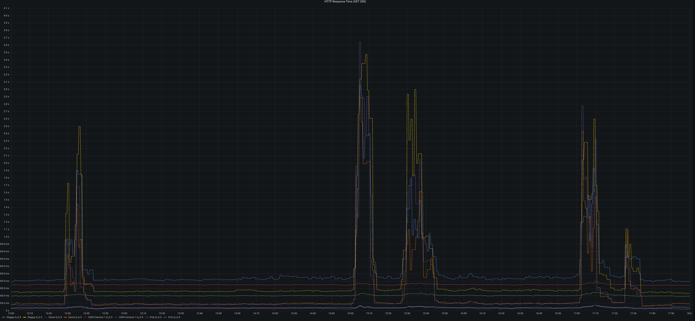
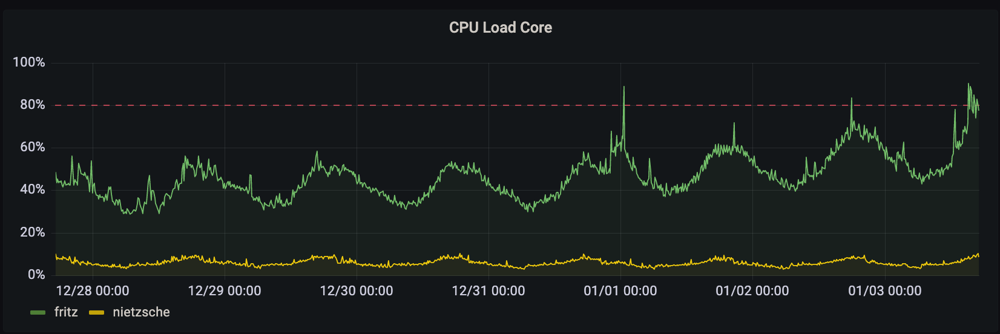

On January 3th, 2023 at approximately 12:30 UTC Hachyderm experienced a spike in
response times.  This appeared to be due to a certificate that had not been
renewed on `fritz`, which runs the Mastodon Puma and Streaming services.  The
service appeared to recover until approximately 15:00 UTC when another spike in
response times was observed.

Alerts were firing in discord alerting us to the issue.

# Background

`fritz` runs mastodon-web and mastodon-streaming and all other web nodes proxy
to `fritz`.

mastodon-web was configured with 16 processes each having 20 threads.

mastodon-streaming was configured with 16 processes

# Impact

p90 response times grew from ~400ms to >2s.
increase of 502 responses to >1000 per minute.

# Root causes and trigger

organic growth in users and traffic coupled with the return from vacation of
the US caused the streaming and puma processes on `fritz` to use more CPU.  CPU
load hit >90% consistently on `fritz`.  this in turn caused responses to fail to
be returned to the upstream web frontends.

### Lessons Learned

response times are very sensitive to puma threads (reducing from 20 to 16 threads
per process doubled GET response times).

the site functions well with fewer streaming processes.

### Things that went well

we had the core CPU load on the public dashboard.

### Things that went poorly

in an attempt to get things under control both mastodon-streaming and
mastodon-web were changed.  puma was then reverted as we had
over-corrected and response times were getting quite bad.

no CPU load alerts were configured for `fritz` specifically.

### Where we got lucky

`@dma` was already keyed in to fritz thanks to an earlier issue where
certs hadn't been renewed.

# Action items

### 1) Streaming processes reduces `@dma` [repair]

Reduced the number of streaming processes on `fritz` from 16 to 12.

### 2) Better alerting on CPU load `@dma` [detect]

We should implement better CPU load alerting on every host to detect these
issues and be able to respond even more quickly.

### 3) Postmortem documented `@dma`

This blog post and a hackmd postmortem doc.
