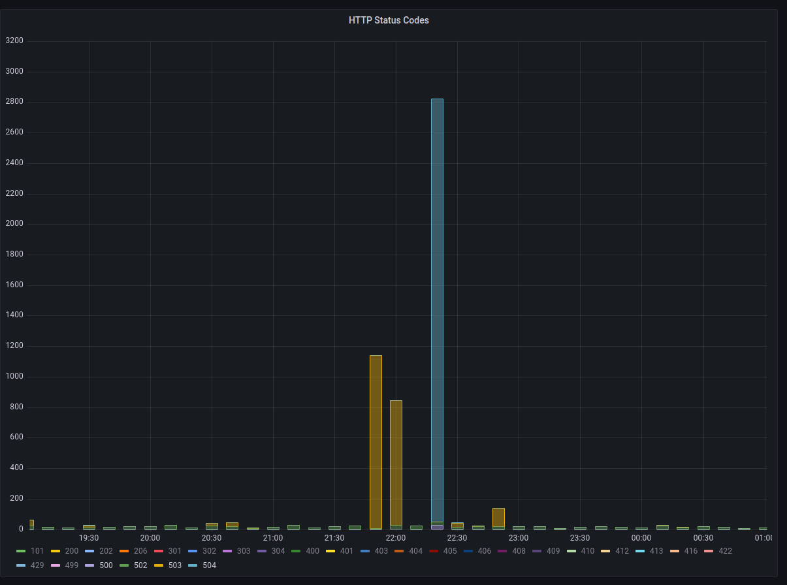
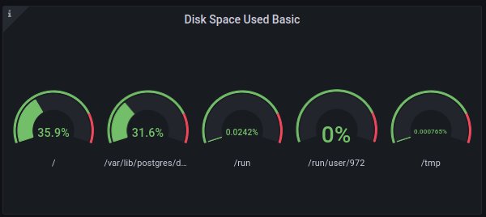

On January 7th, 2023 at approximately 22:26 UTC Hachyderm experienced a spike in HTTP response times as well as a spike in 504 Timeouts across the CDN.




Working backwards from the CDN to `fritz` we discovered another cascading failure.

# Context

There is a fleet of CDN nodes around the world, commonly referred to as "POP" servers (Point of Presence) or even just "The CDN". These servers reverse proxy over dedicated connections back to our core infrastructure. 

These CDN servers served content timeouts at roughly **22:20:00** UTC.

These CDN servers depend on the `mastodon-streaming` service to offer websocket connections.

### Impact

 - Total streaming server outage reported in Discord (Uptime Robot)
 - Slow/Timeouts reported by users in Twitch chat
 - Nóva noticed slow/timeouts on her phone

**HTTP Response Times** measured > 3s

# Background

We received some valuable insight from [@ThisIsMissEm](https://github.com/ThisIsMissEm) who has experience with both node.js websocket servers and the mastodon codebase, which can be read [here in HackMD](https://hackmd.io/8bhI7IWcTvSJvRhu9M45nQ).

An important takeaway from this knowledge is that the `mastodon-streaming` service and the `mastodon-web` service will not rate limit if they are communicating over `localhost`. 

In other words, you should be scheduling `mastodon-streaming` on the same node you are running `mastodon-web`.

We believe that the way the streaming API works, that if there is a **"large event"** such as having a post go out by a largely followed account it can cause a cascading effect on everyone connected via the streaming API.

> A good metric to track would actually be the percentage of connections that a single write is going to. If the mastodon server has one highly followed user, a post by them, especially in a "busy" timezone for the instance, will result in unbalanced write behaviours, where one message posted will result in iterating over a heap more connections than others (one per follower who's connected to streaming), so you can end up doing 40,000 network writes very easily, locking up node.js temporarily from processing disconnections correctly.
 
We believe that the streaming API began to drop connections which cascaded out to the CDN nodes via the `mastodon-web` service. 

We can correlate this theory by connecting observe logged lines to the Mastodon code bash.

##### Logs from `mastodon-streaming` on **Fritz**

```
06-4afe-a449-a42f861855b2 Tried writing to closed socket
33-414d-9143-6a5080bd6254 Tried writing to closed socket
33-414d-9143-6a5080bd6254 Tried writing to closed socket
06-4afe-a449-a42f861855b2 Tried writing to closed socket
06-4afe-a449-a42f861855b2 Tried writing to closed socket
06-4afe-a449-a42f861855b2 Tried writing to closed socket
06-4afe-a449-a42f861855b2 Tried writing to closed socket
06-4afe-a449-a42f861855b2 Tried writing to closed socket
06-4afe-a449-a42f861855b2 Tried writing to closed socket
06-4afe-a449-a42f861855b2 Tried writing to closed socket
06-4afe-a449-a42f861855b2 Tried writing to closed socket
06-4afe-a449-a42f861855b2 Tried writing to closed socket
41-4385-9762-c5c1d829ba27 Tried writing to closed socket
0f-4eb4-9751-b5ac7e21c648 Tried writing to closed socket
06-4afe-a449-a42f861855b2 Tried writing to closed socket
06-4afe-a449-a42f861855b2 Tried writing to closed socket
60-40d1-99b4-349f03610b36 Tried writing to closed socket
60-40d1-99b4-349f03610b36 Tried writing to closed socket
33-414d-9143-6a5080bd6254 Tried writing to closed socket
06-4afe-a449-a42f861855b2 Tried writing to closed socket 
```

##### Code from Mastodon main

```javascript 
  const streamToWs = (req, ws, streamName) => (event, payload) => {
    if (ws.readyState !== ws.OPEN) {
      log.error(req.requestId, 'Tried writing to closed socket');
      return;
    }
```

Found in [mastodon/streaming/index.js](https://github.com/mastodon/mastodon/blob/main/streaming/index.js#L827-L831)

##### Logs (correlation) from `mastodon-web` on **Fritz**

This is where we are suspecting that we are hitting the "Rack Attack" rate limit in the streaming service.

```
-4589-97ed-b67c66eb8c38] Rate limit hit (throttle): 98.114.90.221 GET /api/v1/timelines/home?since_id=109>
```

# Working Theory (root cause)

We are maxing out the streaming service on **Fritz**, and it is rate limiting the mastodon web (puma) service.
The "maxing out" can be described in the write-up by [@ThisIsMissEm](https://github.com/ThisIsMissEm) where NodeJS struggles to process/drop the connections that are potentially a result of a **"Large Event"**.

As the websocket count increases there is a cascading failure that starts on **Fritz** and works it way out to the nodes. 

Eventually the code that is executing (looping) over the large amounts of websockets will **"break"** and there is a large release where a spike in network traffic can be observed.

We see an enormous (relatively) amount of events occur during the second of **22:17:30** on **Fritz** which we suspect is the "release" of the execution path.

As the streaming service recovers, the rest of Hachyderm slowly stabilizes.

### Lessons Learned

Websockets are a big deal, and will likely be the next area of our service we need to start observing. 

We will need to start monitoring the relationship between the streaming service and the main mastodon web service pretty closely.

### Things that went well

We found some great help on Twitch, and we ended up discovering an unrelated (but potentially disastrous) problem with **Nietzsche** (the main database server).

We have a path forward for debugging the streaming issues.

### Things that went poorly

Nóva was short on Twitch again and struggles to deal with a lot of "noise/distractions" while she is debugging production.

In general there isn't much more we can do operationally other than keep a closer eye on things. The code base is gonna' do what the code base is gonna' do until we decide to fork it or wait for improvements from the community.

### Where we got lucky

Seriously the **Nietzsche** discovery was huge, and had nothing to do with the streaming "hiccups".  We got extremely lucky here.

Consequently, Nóva fixed the problem on **Nietzsche** which was that our main database NVMe disk was at 98% capacity. 

 - We did NOT receive storage alerts in Discord (I believe we should have?)
 - Nóva could NOT find an existing cron job on the server to clean the archive.
 - Nóva scheduled the cron job (Using `sudo crontab -e`) 

The directory (archive) that was full:

```
/var/lib/postgres/data/archive
```

**Nietzsche** is now back down to ~30%



# Action items

### 1) Set up websocket observability on CDN nodes (clients) and Fritz (server)

We want to see how many "writes" we have on the client side and how many socket connections they are mapped to if possible. We might need to PR a log entry for this to the Mastodon code base.

### 2) Verify cron is running on Nietzsche

We need to make sure the cron is running and the archive is emptying 

### 3) Debug why we didn't receive Nietzsche alerts 

I think we should have seen these, but I am not sure?

### 4) We likely need a bigger "Fritz"

Sounds like we need donations and a bigger server (it will be hard to move streaming off of the same machine as web).
