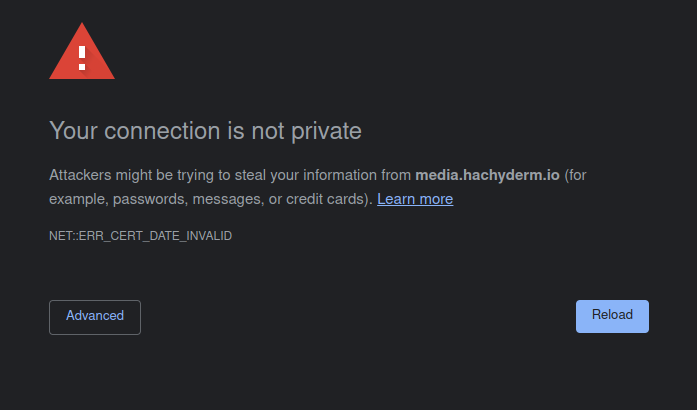

On February 28th, 2023 at approximately 01:55 UTC Hachyderm experienced a service degradation in which images failed to load in production.

We were able to quickly identify the root cause as expired TLS certificates in production for `media.hachyderm.io`



# Context

Hachyderm TLS certificates are still managed manually, and are very clearly out of sprawling out of control due to our rapid growth. There are many certificates on various servers that have had config copied from one server to another as we grew into our current architecture. 

The alert notification was missed, and the `media.hachyderm.io` TLS `privkey.pem` and `fullchain.pem` material expired causing the service degradation.

### Timeline

- Feb 28th **01:52** `@quintessence` First report of media outages
- Feb 28th **01:54** `@nova` Confirms media is broken from remote proxy in EU
- Feb 28th **01:56** `@nova` Appoints `@quintessence` as incident commander
- Feb 28th **01:57** `@nova` Confirms TLS expired on `media.hachyderm.io`
- Feb 28th **02:30** `@nova` Live streaming [fixing TLS](https://youtu.be/kMf0KOlSNdk?t=1561)

Shortly after starting the stream we discovered that the Acme challenge was not working because the `media.hachyderm.io` DNS record was pointed to `CNAME hachyderm.io` and the proxy was not configured to manage the request. In the past we have worked around this by editing the CDN on the East coast which is where the Acme challenge will resolve. 

In this case we changed the `media.hachyderm.io` DNS record to point to `A <ip-of-fritz>` which is where the core web server was running. 

We re-ran the renew process and it worked!

```bash 
sudo -E certbot renew
```

We then re-pointed `media.hachyderm.io` back to `CNAME hachyderm.io`.

Next came the `scp` command to move the new cert material out to the various CDN nodes and restart nginx.

```bash
# Copy TLS from fritz -> CDN host
scp /etc/letsencrypt/archive/media.hachyderm.io/* root@<host>:/etc/letsencrypt/archive/media.hachyderm.io/

# Access root on the CDN host
ssh root@<host>

# Private key (on CDN host)
rm -f /etc/letsencrypt/live/media.hachyderm.io/privkey.pem
ln -s /etc/letsencrypt/archive/media.hachyderm.io/privkey3.pem /etc/letsencrypt/live/media.hachyderm.io/privkey.pem

# Fullchain (on CDN host)
rm -f /etc/letsencrypt/live/media.hachyderm.io/fullchain.pem
ln -s /etc/letsencrypt/archive/media.hachyderm.io/fullchain3.pem /etc/letsencrypt/live/media.hachyderm.io/fullchain.pem
```

The full list of CDN hosts:

 - cdn-frankfurt-1
 - cdn-fremont-1
 - sally
 - esme

Restarting `nginx` on each of the CDN hosts was able to fix the problem.

```bash 
# On a CDN host
nginx -t               # Test the config
systemctl reload nginx # Reload the service

# On your local machine 
emacs /etc/hosts       # Point "hachyderm.io" and "media.hachyderm.io" to IP of CDN host

# Check your browser for working images
```

### Impact

 - Full image outage across the site in all regions.
 - A stressful situation interrupting dinner and impacting the family.
 - Even more chaos and confusion with certificate material.

### Lessons Learned

 - We still have outstanding legacy certificate management problems.

### Things that went well

 - We had a quick report, and the mean time to resolution was <60 mins.

### Things that went poorly

 - The certs are in an even more chaotic state.
 - There was no alerting that the images broke.
 - There was a high stress situation that impacting our personal lives.

### Where we got lucky
 
 - I still had access to the servers, and was able to remedy the situation from existing knowledge.

# Action items

 - We need to destroy the vast majority of nginx configurations and domains in production
 - We need to destroy all TLS certs and re-create them with a cohesive strategy
 - We need a better way to perform the Acme challenge that doesn't involve changing DNS around the globe
 - Nóva to send list of domains to discord to destroy

