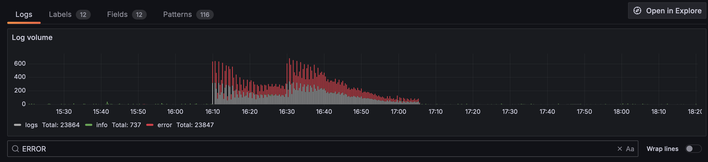
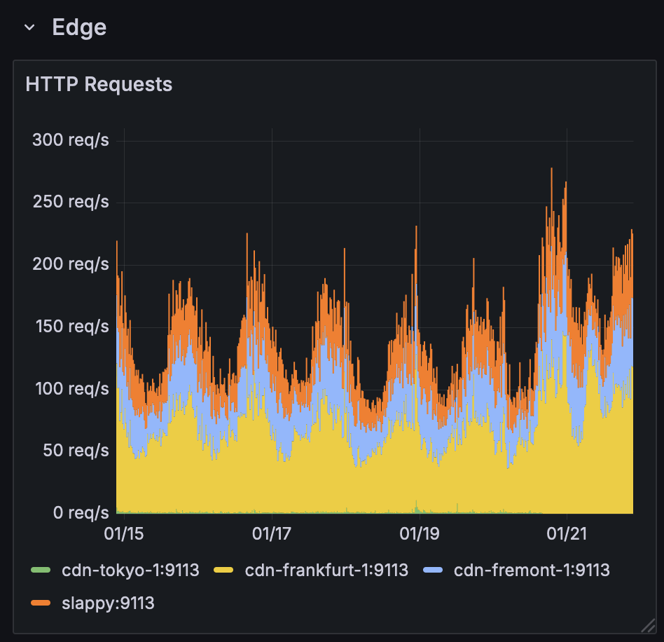

On Monday, January 20th, 2025 at roughly 17:00 UTC Hachyderm started to experience elevated 500 error levels during routine system maintenance.

On Tuesday, January 21st, 2025 at roughly 17:20 UTC Hachyderm started to again experience elevated 500 error levels. Hachyderm appeared to still be up, but there were reports of outages.

Impacted users experienced 500 internal server error responses from `https://hachyderm.io` in all regions of the world.

## Context

As part of routine updates, we went through each of our machines and ran regular system updates.

Two of the updated packages included `libicu` and `libvips`. The affected machines involved were the  `mastodon-web` machines, known as `fritz` and `buttons`, and `mastodon-sidekiq` machines, known as `franz` and `freud`. `nietzsche` is our database server, which we are in the process of replacing.

## Timeline

All events are documented in [UTC](https://en.wikipedia.org/wiki/Coordinated_Universal_Time) time.

### 2025-01-20
 - **15:38** `@esk` Started doing routine system updates
 - **16:35** `@esk` Ran system updates on `buttons` 
 - **16:43** `@esk` Rebooted `buttons`, and questioned if we'd have issues due to the `libicu` update, since this is compiled into ruby dependencies for Mastodon
 - **16:44** `@esk` Noted that `buttons` seemed okay
 - **16:45** `@esk` Started system updates on `fritz`
 - **16:57** `@esk` Rebooted `fritz`
 - **16:59** `@esk` Noted that whilst `fritz` was down for maintenance, requests did not correctly failover to `buttons`
 - **17:00** `@ThisIsMissEm` Responded saying that failover should have happened based on our CDN configuration, but for some reason the CDN didn't see `fritz` as being down
 - **17:18** `@esk` Noted that something didn't look good whilst attempting to run system updates on `franz`. Logs were showing a database connection error:
    ```
    [novix@franz]: ~$ sudo journalctl -xeu mastodon-sidekiq-ingress@1
    Jan 20 17:18:41 franz bundle[600]: 2025-01-20T17:18:41.618Z pid=600 tid=2pgw class=ActivityPub::ProcessingWorker jid=b29a74a7be10bcbcdba588be elapsed=30.137 INFO: fail
    Jan 20 17:18:41 franz bundle[600]: 2025-01-20T17:18:41.618Z pid=600 tid=2pgw WARN: {"context":"Job raised exception","job":{"retry":8,"queue":"ingress","backtrace":true,"args":[1125751588830572xx,"{\"@context\":[\"https://www.w3 Jan 20 17:18:41 franz bundle [600]: 2025-01-20T17:18:41.618Z pid=600 tid=2pgw WARN: ActiveRecord::DatabaseConnectionError: There is an issue connecting with your hostname: nietzsche. Jan 20 17:18:41 franz bundle [600]: Please check your database configuration and ensure there is a valid connection to your database.
    Jan 20 17:18:41 franz bundle [600]: 2025-01-20T17:18:41.618Z pid=600 tid=2pgw WARN: /var/lib/mastodon-versions/v4.3.3/vendor/bundle/ruby/3.3.0/gems/activerecord-7.1.5.1/lib/active_record/connection_adapters/postgresql_adapter.rb:7 Jan 20 17:18:41 franz bundle [600]: /var/lib/mastodon-versions/v4.3.3/vendor/bundle/ruby/3.3.0/gems/activerecord-7.1.5.1/lib/active_record/connection_adapters/postgresql_adapter.rb:68:in
    `new_client'
    Jan 20 17:18:41 franz bundle[600]: /var/lib/mastodon-versions/v4.3.3/vendor/bundle/ruby/3.3.0/gems/activerecord-7.1.5.1/lib/active_record/connection_adapters/postgresql_adapter.rb:980:in `connect' Jan 20 17:18:41 franz bundle[600]: 2025-01-20T17:18:41.919Z pid=600 tid=650 INFO: Shutting down
    Jan 20 17:18:41 franz systemd[1]: Stopping mastodon-sidekiq...
    ```

    The specific part to note is:
    ```
    WARN: ActiveRecord::DatabaseConnectionError: There is an issue connecting with your hostname: nietzsche.
    Jan 20 17:18:41 franz bundle [600]: Please check your database configuration and ensure there is a valid connection to your database.
    ```
 - **17:19** An incident call was started between `@esk` and `@ThisIsMissEm`
 - **17:20** `@esk` Tested the connectivity to nietzsche, our database server, and connectivity was fine.
 - **17:20** `@esk` Noted a suspicion it might be because of ruby/icu update.
 - **17:20** `@esk` Performed a reinstall of ruby on the affected machine (`franz`)
 - **17:25** After reinstall `franz` appeared to start up sidekiq fine.
 - **17:30** Some investigation happened into a warning that was being generated:
    ```
    (process:24889): VIPS-WARNING **: 17:30:23.963: unable to load "/usr/lib/vips-modules-8.16/vips-poppler.so" -- libpoppler-glib.so.8: cannot open shared object file: No such file or directory
    (process:24889): VIPS-WARNING **: 17:30:23.963: unable to load "/usr/lib/vips-modules-8.16/vips-openslide.so" -- libopenslide.so.1: cannot open shared object file: No such file or directory
    ```
 - **17:35** `@esk` Installed the missing packages for `libpoppler` and `libopenslide` resolving the warnings.
 - **17:43** `@ThisIsMissEm` responded that these errors had actually always been present, as we didn't use poppler or openslide with libvips, so hadn't installed them.
 - **17:59** Discussion between `@ThisIsMissEm` and `@esk` about the failover not happening correctly.
    - Something was making the CDN nodes not detect that the `mastodon-web` nodes were down
    - Was identified to be because of caching configuration existing on `fritz` and `buttons` nginx, which had existed when `fritz` was still exposed directly to the internet (we'd moved everything behind CDN back in November/December as part of our [Global Resiliency Plan]())
    - This caching on `fritz` and `buttons` meant that even though they were down, some percentage of requests were still responding from the cache as 200 responses, so CDN nodes didn't detect they were down.
 - **18:00** Initial incident call ended
 - **18:30** First confirmation, and first report of 500 responses globally
 - **18:40** `@esk` Decided to reinstall ruby on all mastodon-web machines.
 - **19:00** `@esk` Noted that `buttons` wasn't starting up correctly after reinstalling ruby, reporting the same database connection error as the `franz` earlier.
 - **19:00** New incident response call started
 - **19:40** After reinstalling ruby on `buttons` and `fritz`, the logs looked fine, and the alert stopped firing.

### 2025-01-21:
- **15:15** Alerts started firing for elevated 500 error levels, `@ThisIsMissEm` was the only person about at the time, but hadn't been receiving notifications for the alerts.
- **17:20** Community member reported seeing 500 errors when attempting to use Hachyderm, which `@ThisIsMissEm` saw.
- **17:21** `@ThisIsMissEm` confirmed outage via grafana:
    
    <br /><br />
- **17:23** `@ThisIsMissEm` noticed that there were database connection errors on `buttons` too:
    ```
    Jan 21 15:51:55 buttons bundle[807963]: E, [2025-01-21T15:51:55.658538 #807963] ERROR -- : [65517bcd-64a2-4cd8-922e-440466a8e499]
    Jan 21 15:51:55 buttons bundle[807963]: [65517bcd-64a2-4cd8-922e-440466a8e499] ActiveRecord::DatabaseConnectionError (There is an issue connecting with your hostname: nietzsche.
    Jan 21 15:51:55 buttons bundle[807963]: Please check your database configuration and ensure there is a valid connection to your database.
    Jan 21 15:51:55 buttons bundle[807963]: ):
    Jan 21 15:51:55 buttons bundle[807963]: [65517bcd-64a2-4cd8-922e-440466a8e499]
    Jan 21 15:51:55 buttons bundle[807963]: [65517bcd-64a2-4cd8-922e-440466a8e499] app/models/domain_block.rb:73:in `rule_for'
    Jan 21 15:51:55 buttons bundle[807963]: [65517bcd-64a2-4cd8-922e-440466a8e499] app/models/domain_block.rb:49:in `suspend?'
    Jan 21 15:51:55 buttons bundle[807963]: [65517bcd-64a2-4cd8-922e-440466a8e499] app/helpers/domain_control_helper.rb:16:in `domain_not_allowed?'
    Jan 21 15:51:55 buttons bundle[807963]: [65517bcd-64a2-4cd8-922e-440466a8e499] app/controllers/concerns/signature_verification.rb:223:in `actor_from_key_id'
    Jan 21 15:51:55 buttons bundle[807963]: [65517bcd-64a2-4cd8-922e-440466a8e499] app/controllers/concerns/signature_verification.rb:56:in `signed_request_actor'
    Jan 21 15:51:55 buttons bundle[807963]: [65517bcd-64a2-4cd8-922e-440466a8e499] app/controllers/concerns/signature_verification.rb:20:in `require_actor_signature!'
    Jan 21 15:51:55 buttons bundle[807963]: [65517bcd-64a2-4cd8-922e-440466a8e499] lib/mastodon/rack_middleware.rb:9:in `call'
    Jan 21 15:51:55 buttons bundle[807848]: I, [2025-01-21T15:51:55.675758 #807848]  INFO -- : [a4191d7b-c2c6-4233-9ef0-e97b43886729] method=GET path=/api/v2/notifications/policy format=*/*
    ```
- **17:23** `@ThisIsMissEm` started investigating if we actually did have a database outage, since it couldn't be related to the updates performed the day before as we'd "fixed" that issue.
- **17:25** `@ThisIsMissEm` reached out to other Mastodon admins to see if they had encountered this error, since the database appeared to be reachable. That led to the suggestion to check the error logs on the database servers just in case.
- **17:45** `@ThisIsMissEm` discovered that `pgbouncer` on `nietzsche` was actually logging errors, but no alerts were firing.
  ```
  Jan 21 15:51:56 host pgbouncer[8342]: 2025-01-21 15:51:56.202 UTC [8342] ERROR accept() failed: Too many open files
  ```
  This was the cause of the error from the previous day:
  ```
  WARN: ActiveRecord::DatabaseConnectionError: There is an issue connecting with your hostname: nietzsche.
  Jan 20 17:18:41 franz bundle [600]: Please check your database configuration and ensure there is a valid connection to your database.
  ```
  The database was indeed actually down and unreachable, because mastodon-web and mastodon-sidekiq couldn't acquire a connection via pgbouncer.
- **17:45-18:45** Team discussed the appropriate solution to increase available file handles to pgbouncer, this wasn't something `@ThisIsMissEm` knew how to resolve on her own, and documentation for how to increase these limits in systemd was confusing.

    In the systemd file, you need to do:
    ```
    LimitNOFILE=3000:524288
    ```
    which then gets printed as:
    ```
    LimitNOFILE=524288
    LimitNOFILESoft=3000
    ```
- **17:50** Outage confirmed to be resolved

## Root Cause

An error that first appeared during system updates was misinterpreted to be caused by the system updates, rather than a separate system actually being in a failure mode. The database load balancer, pgbouncer had been configured for 2000 connections, but only 1024 max file handles. Hachyderm's recent infrastructure changes had resulted in the maximum potential database connections raising to 1428.

The 500 errors were actually database errors, and not related to the system updates. It just so happened that when we were performing the upgrades, we also experienced elevated traffic levels, which pushed us over the 1024 connections that pgbouncer could support.



### Things that went well

TODO

### Things that went poorly

Multiple different issues were happening simultaneously:
- Increased HTTP requests resulting in database connection exhaustion
- System updates to packages known to have caused issues in the past
- CDN failover not happening correctly

There was a lack of alerts on pgbouncer errors which resulted in the database issue not being discovered in a timely fashion.

We didn't check the grafana dashboards for 500 errors, which would have indicated that the outage actually started slightly before the updates were performed.

### Opportunities 

We need to improve our monitoring and alerting on critical systems.

We need to improve our nginx configuration to ensure failover works correctly

We need to review our pgbouncer and postgresql configuration

## Resulting Action

#### 1) Alerts added for pgbouncer errors by `@ThisIsMissEm`

Alerts for error loglines on pgbouncer were added.

#### 2) Spreadsheet created to correctly calculate database connections required `@ThisIsMissEm`

This will be published after review from the Hachyderm team. We'd previously manually run the mathematics set out in `@hazelweakly`'s fantastic [Scaling Mastodon](https://hazelweakly.me/blog/scaling-mastodon/#db_pool-notes-from-nora's-blog) blog post.