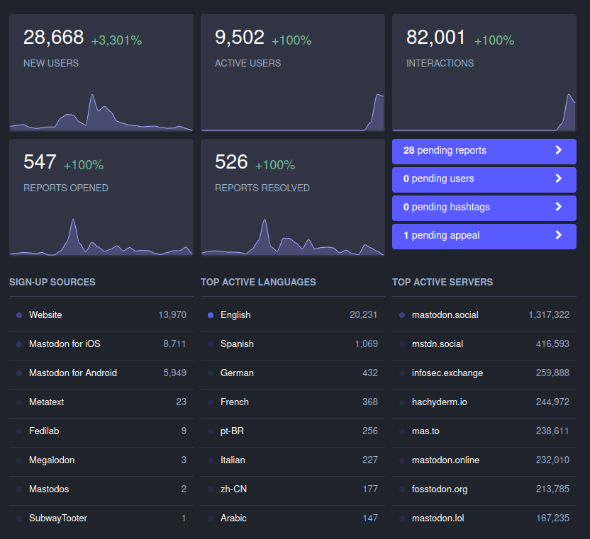

Thank you to everyone who has been patient with Hachyderm as we have had to make some adjustments to how we do things.
Finding ourselves launched into scale has impacted our people more than it has impacted our systems.

I wanted to provide some visibility into our intentions with Hachyderm, our priorities, and immediate initiatives. 

### Transparency Reports

We intend on offering transparency reports similar to the [November Transparency Report from SFBA Social](https://hub.sfba.social/2022/12/02/transparency-report-november-2022/). 
It will take us several weeks before we will be able to publish our first one.

The immediate numbers from the administration dashboard are below.

### Donations

On January 1st, 2023 we will be changing our financial model.

Hachyderm has been operating successfully since April of 2022 by funding our infrastructure from the proceeds of Kris Nóva's Twitch presence. 

In January 2023 we will be rolling out a new financial model intended to be sustainable and transparent for our users. 
We will be looking into donation and subscription models such as Patreon at that time.

From now until the end of the year, Hachyderm will continue to operate using the proceeds of Kris Nóva's Twitch streams, and our donations through the [ko-fi](https://ko-fi.com/krisnovalive) donation page.

### Governing Body

We are considering forming a legal entity to control Hachyderm in January 2023.

At this time we are not considering a for-profit corporation for Hachyderm.

The exact details of what our decision is, will be announced as we come to conviction and seek legal advice.

### User Registration 

At this time we do not have any plans to "cap" or limit user registration for Hachyderm.

There is a small chance we might temporarily close registration for small limited periods of time during events such as the [DDoS Security Threat](https://hachyderm.io/@nova/109451616906969285).

To be clear, we do not plan on rolling out a formal registration closure for any substantial or planned period of time.
Any closure will be as short as possible, and will be opened up as soon as it is safe to do so.

We will be reevaluating this decision continuously. If at any point Hachyderm becomes bloated or unreasonably large we will likely change our decision.

### User Registration and Performance 

At this time we do not believe that user registration will have an immediate or noticeable impact on the performance of our systems.
We do not believe that closing registration will somehow "make Hachyderm faster" or "make the service more reliable".

We will reevaluating this decision continuously. If at any point the growth patterns of Hachyderm changes we will likely change our decision.

### Call for Volunteers

We will be onboarding new moderators and operators in January to help with our service. To help with that, we have created a short Typeform to consolidate all the volunteer offers so it is easier for us to reach back out to you when we're ready:

[Hachyderm Interest Form](https://5ye40vg1ub3.typeform.com/to/HS1puq1o)

The existing teams will be spending the rest of December cleaning up documentation, and building out this community resource in a way that is easy for newcomers to be self sufficent with our services.

As moderators and infrastructure teams reach a point of sustainability, each will announce the path forward for volunteers when they feel the time is right.

The announcements page on this website, will be the source of truth.

### Our Promise to Our users

Hachyderm has signed [The Mastodon Server Covenant](https://joinmastodon.org/covenant) which means we have given our commitment to give users at least 3 months of advance warning in case of shutting down. 

My personal promise is that I will do everything in my power to support our users any way I can that does not jeopardize the safety of other users or myself.

We will be forming a broader set of governance and expectation setting for our users as we mature our services and documentation.

### Sustainability 

I wanted to share a few thoughts on sustainability with Hachyderm. 

Part of creating a sustainable service for our users will involve participation from everyone.
We are asking that all Hachydermians remind themselves that time, patience, and empathy are some of the most effective ways in creating sustainable services.

There will be some situations where we will have to make difficult decisions with regard to priority. 
Often times the reason we aren't immediately responding to an issue isn't because we are ignoring the issue or oblivious to it. It is because we have to spend our time and effort wisely in order to keep a sustainable posture for the service.
We ask for patience as it will sometimes take days or weeks to respond to issues, especially during production infrastructure issues.

We ask that everyone reminds themselves that pressuring our teams is likely counter productive to creating a sustainable environment.
