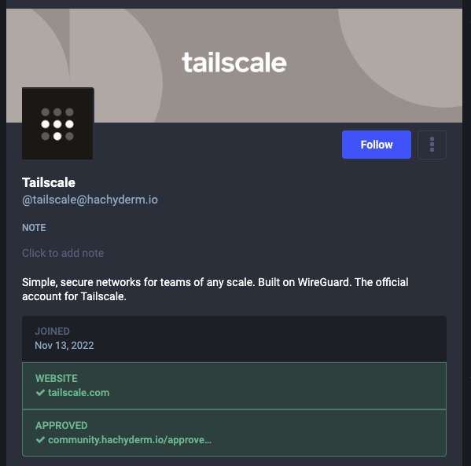

Hello and welcome to April! This month we'll be reviewing the account
verification process we rolled out as well as two more classic moderation
topics: how to file a report and what to do if you're moderated.

<!-- do not manually edit: table generated by Markdown All-In-One -->

- [Account Verification](#account-verification)
  - [Mastodon account verification is like an identity service](#mastodon-account-verification-is-like-an-identity-service)
  - [Hachyderm verification makes verification visible on an account profile](#hachyderm-verification-makes-verification-visible-on-an-account-profile)
  - [Specialized accounts should be verified](#specialized-accounts-should-be-verified)
  - [We support small orgs, startups, self-run businesses, non-profits, etc.](#we-support-small-orgs-startups-self-run-businesses-non-profits-etc)
- [How to file outstanding moderation reports](#how-to-file-outstanding-moderation-reports)
  - [Always include a description with your own words](#always-include-a-description-with-your-own-words)
  - [(Almost) Always include relevant posts](#almost-always-include-relevant-posts)
  - [Be clear when you are forwarding a report (or not)](#be-clear-when-you-are-forwarding-a-report-or-not)
- [Meter yourself when filing reports](#meter-yourself-when-filing-reports)
- [When you've been moderated](#when-youve-been-moderated)
  - [Take warnings to heart, but they do not require an appeal](#take-warnings-to-heart-but-they-do-not-require-an-appeal)
  - [Always include your email when appealing an account restriction](#always-include-your-email-when-appealing-an-account-restriction)
  - [Let us know if we've made a mistake](#let-us-know-if-weve-made-a-mistake)

## Account Verification 

Throughout the month of March we started circulating an account verification
process that launched. What does this mean, how do we use it, and what does it
tell Hachydermians?

### Mastodon account verification is like an identity service

Verification in the Mastodon context is similar to an ID verification service.
When you build your profile you have four fields that are labeled "profile
metadata". When you include a URL that you have a `rel=me` link to your
Mastodon profile on, then that URL highlights green with a corresponding
green checkmark. In that case, the URL is verified: confirming that the person
who has control of the account also has control of the domain.

### Hachyderm verification makes verification visible on an account profile

Since some specialized accounts are restricted on Hachyderm, we decided to make
it more immediately visible which accounts are approved or not. As part of these
discussions, we also extended the verification process to even non-restricted
specialized accounts.

In order to verify, specialized accounts use the process outlined on our
[Account Verification page](/docs/account-types/verification/) which includes
agreeing to the [Specialized Account Expectations](/docs/account-types/covenant/)
and using our Community GitHub issues to submit the request. Once approved,
we add their Hachyderm account to an approval page we created for this process.
For an example of what the end result looks like, take a look at one of our
first corporate accounts, [Tailscale](https://hachyderm.io/@tailscale):

### Specialized accounts should be verified

As a reminder, the only accounts we're currently requiring to be verified are:

* Corporate accounts
* Bot accounts
* Curated accounts

That said, the account verification process is open to _all_ specialized accounts.
This includes but is not limited to: non-profits, conferences, meetups, working groups,
and other "entity" based accounts.

Account verification is not open to individual users at this time. That said,
if you are an independent contractor or similar type of individual / self-run
business please read on.

### We support small orgs, startups, self-run businesses, non-profits, etc.

Please email us at [admin@hachyderm.io](mailto:admin@hachyderm.io) if this applies to
your account or an account you would like to create. This is the grey area for all
accounts that due to size, model, or "newness" don't fit cleanly into the account
categories we've tried to create.

In particular, if you suspect you might fit our criteria for a corporate account but the
[pricing model](/docs/account-types/corporate-accounts/) would be a burden for you:
please still reach out! We're happy to help and try to figure something out.

## How to file outstanding moderation reports

First of all: thank you to everyone for putting your trust in us and for sending reports our way.
Reports on any given day or week can vary and include mixtures of spam, on and off server bad
behavior, and so on. When you send reports our way, here are the main things to keep in mind
so that your reports are effective.

Please see our [Reporting and Communication doc](https://community.hachyderm.io/docs/moderation/reporting/),
which details Hachyderm specific information, and
our [Report Feature doc](https://community.hachyderm.io/docs/mastodon/moderation/report-feature/), which shows
what we see when we receive a report, for reference. 

### Always include a description with your own words

You should always include a description with your report. It can be as succinct as "spam"
or more descriptive like "account is repeatedly following / unfollowing other users". You
should include a description even if the posts, when included, seem to speak for themselves.
If you are reporting content in a language other than English, please supply translations
for any dog whistles or other commentary that a translation site will likely miss in a word-for-word
translation.

Mastodon also deletes posts from reports more than 30 days old. So in the event that we need
to check on a user and/or domain that has been reported more than once, but infrequently,
the added context can also help us capture information that is no longer present.

### (Almost) Always include relevant posts

If you are reporting a user because of something they have posted, you should (almost)
always include the posts themselves. When a post is reported, the post is saved in the
report even if the user's home instance deletes the posts. If the posts are not included,
and the user and/or their instance mods delete the posts, then we have an empty report
with no additional context.

Please feel free to use your best judgement when choosing to attach posts to a report or not.
In the rare situation where you are reporting extreme content, especially with imagery,
you can submit a report without posts but please ensure that you have included the context
for what we can expect when we investigate the user and/or domain.

### Be clear when you are forwarding a report (or not)

When you file reports for users that are off-server, you will have the option to forward
the report to the user's server admins. When a report is not forwarded, only the Hachyderm
moderation team sees it. Reports forward to remote instance admins by default. If you are
choosing not to forward a report for a remote user, please call it out in your comments.
Although we can see when a report isn't forwarded, the added visibility helps.

There will be times when a reported user's infraction falls under the purview of their
instance moderators and whatever server rules that user has agreed to and may be in
violation of. Typically, we will only step in to moderate these situations when we
need to de-federate with a remote user and/or instance completely.

## Meter yourself when filing reports

We appreciate everyone who takes the time to send us a report so we can work towards
keeping the Hachyderm community safe. Make sure when you are doing so that you are
being mindful of your own [mental health](https://community.hachyderm.io/docs/hachyderm/mental-health/)
as well. As a moderation team, we are able to load balance the reports that come through
to protect us individually from burnout or from seeing content that can strongly, negatively,
impact us on a personal level.

Even in situations where there is yet another damaging news cycle, which in turn creates
a lot of downstream effects, individuals should avoid taking on what it takes a team
to tackle. In these situations, please balance the reports you send with taking steps 
to separate yourself from continued exposure to that content. For tips and
suggestions about how to do this, please see our
[March Moderator Minute](/blog/2023/03/16/a-minute-from-the-moderators/)
and [our Mental Health doc](/docs/hachyderm/mental-health/).

<!-- FIXME: Basically for the above: dont' go into the fray. -->

## When you've been moderated

Being moderated is stressful! We understand and do our best to intervene only when
required to maintain community safety or when accounts need to be nudged to be in
alignment with rules for their account type and/or server rules.

For additional information on the below, please see both our
[Reporting and Communication doc](https://community.hachyderm.io/docs/moderation/reporting/)
and our [Moderation Actions and Appeals doc](https://community.hachyderm.io/docs/moderation/actions-and-appeals/).

### Take warnings to heart, but they do not require an appeal

Warnings are only used as a way to communicate with you using the admin tools.
They are not accrued like a "strike" system, where something happens if you exceed
a certain number. Since we only send warnings when an account needs a nudge, either
a small rule clarification or similar, they do not need to be appealed. Appeals to
warnings will typically receive either no action or a rejection for this reason.

### Always include your email when appealing an account restriction

If your account has been restricted in some way, e.g. either frozen or suspended, then you
will need to file an appeal to open a dialogue for us to reverse that decision. You should
always include how we can email you in your appeal: the admin UI does not let us respond
to appeals. We can only accept (repeal) or reject (keep) the decision.

### Let us know if we've made a mistake

If we've made an error in moderating your account: apologies! We do our best, but mistakes
can and will happen. If your account has been restricted, please file an appeal the same
as in the above: by including the error and your email so we can follow up with you as needed.
Once we have the information we need we can reverse the error.
