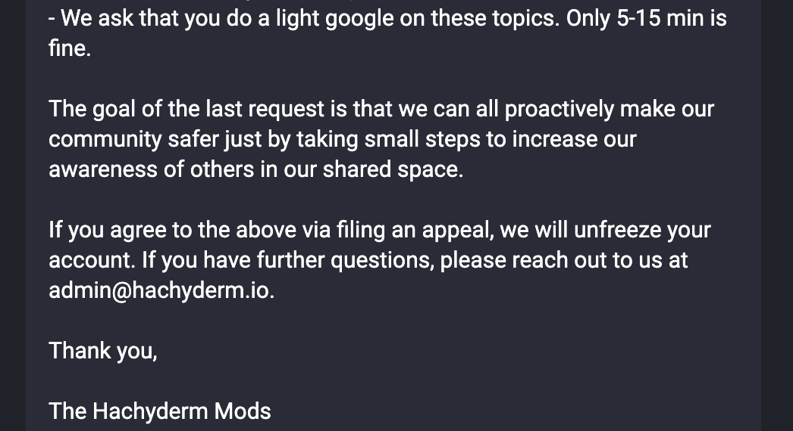

Happy Friday Hachydermia! It's time for, you guessed it, the monthly
Moderator Minute! Recently,
[our founder and former admin stepped down](../../../04/30/stepping-down-from-hachyderm/).
As sad as we are to see her go, this does provide an excellent segue
into the topics that we wanted to cover in this month's Moderator Minute! 

<!-- do not manually edit: table generated by Markdown All-In-One -->

- [The big question: will Hachyderm be staying online?](#the-big-question-will-hachyderm-be-staying-online)
- [Moderation at scale](#moderation-at-scale)
  - [A successful moderation team must have a variety of lived experiences](#a-successful-moderation-team-must-have-a-variety-of-lived-experiences)
  - [A successful moderation team must have high social awareness](#a-successful-moderation-team-must-have-high-social-awareness)
  - [A successful moderation team is resilient](#a-successful-moderation-team-is-resilient)
    - [Resilient to change](#resilient-to-change)
    - [High communication](#high-communication)
    - [Mediation / Conflict](#mediation--conflict)
- [Harm prevention on large instance](#harm-prevention-on-large-instance)

## The big question: will Hachyderm be staying online?

**Yes!**

At Hachyderm we have been scaling our Moderation and Infrastructure teams since
the Twitter Migration started to land in November 2022. Everyone on both teams is a
volunteer, which means that we intentionally oversized our teams to accommodate
high fluctuations in availability. There are anywhere from 4-10 members active 
on each team at any given time and each team has a team lead. Both teams are

As a volunteer based org, both teams were intentionally structured to be
resilient to change. What this means for the moderation team specifically
is the topic of today's blog post!

## Moderation at scale

Large instances like ours are mostly powered by humans and process. And
computers, of course. But mostly humans.

Some (many?) of you may remember our Call for Volunteers back in December 2022.
That was when we did our first push to scale our teams - both moderation and
infrastructure.

### A successful moderation team must have a variety of lived experiences

It is worth mentioning that Hachyderm always had a team based structure,
even prior to the Twitter Migration landing. We just needed to scale those
teams to compensate for the additional labor of suddenly becoming a larger
instance. For both our original and then-new moderators, there were a few
criteria we looked at:

* Their demographics
* Their experiences with community moderation
* Their experiences moderating on the "open internet"

The goal was to increase the moderation team's ability to make informed
decisions with more voices. Our community is filled with people who
don't necessarily speak English as a first language, are members of a
variety of religions, are outside of the United States, have a variety
of racial and ethnic backgrounds, have varying ability status, and so
on. We needed to increase the lived experiences of the moderation
team to accomodate these as much as possible.

### A successful moderation team must have high social awareness

There are two primary goals of having an intentionally diverse moderation
team:

1. The direct lived experiences they bring
2. The increased awareness and flexibility that the team has a result

The first one is probably very self explanatory. Each of our lived
experiences have informed our mental model of the world and how
we 

### A successful moderation team is resilient

#### Resilient to change

#### High communication

#### Mediation / Conflict

## Harm prevention on large instance

In order to successfully moderate a larger instance, the moderation team
has two main levers for harm prevention:

* Research
* Accountability

Our research is driven by the enforced opinion that moderation reports
are harm already done. (We mentioned this stance in our recent
[postmortem](../../02/moderation-postmortem/) as well.) Essentially, if someone has filed a
report for moderation action because harm has been done, then that harm
_has been_ done.

In order to prevent harm being done, our Head Moderator started the
practice to have the moderation team actively research sources of
harm and those affilated with those sources. The moderation team
then takes the research results and uses the moderation tools to
take the appropriate action to prevent harmful activity from entering
our community.

The above situations are how the moderation team handles egregious
sources of harmful content. For less severe situations, where there
are more normal interpersonal conflicts or situations where users
can be nudged in the right direction, we use the
[freeze feature](https://community.hachyderm.io/docs/moderation/actions-and-appeals/)
to nudge the user back to the right direction. 

The idea here is that we are all responsible for stewarding safe
spaces. The way to help people be nudged in the right direction
is to help them see what the problem is. For this reason, Hachyderm
moderators rarely delete posts. Instead, we freeze the person's
account and, as part of restoring normal account activity, we
request the user delete their own posts.

Situationally dependent, we may also ask the user to lightly
search the topic that is central to the conflict itself. The goal
of this is to have the person start to see new perspectives and
increase their awareness of the topic at hand. This style of
message might end with something like this:

The reason we ask for such a brief search is because we
do not expect someone to become an expert overnight. We do
expect that all of us take small steps together to learn
and grow. 

And that's it for this month's Moderator Minute! We'll see
you next month in June! :heart: