Hello Hachydermia and broader Fediverse! Thank you for your patience with this blog post, which is about Moderation Reports and Actions. It is significantly longer than the other blog posts will be in this series for a couple reasons:

* Multiple screenshots from the different menus and types of reports 
* Responding to reports is one of the many critical activities of a moderation team

This blog post is also intended to function both as a blog post and as entry level user documentation for the Mastodon Moderation Report feature and the actions moderators can take. As already mentioned it is long, so there are two parts. This post is Part A and the next part will be Part B and focus on communication strategies relevant to moderation activity.

<!-- do not manually edit: table generated by Markdown All-In-One -->

- [Context setting](#context-setting)
- [Getting started](#getting-started)
  - [Our test accounts](#our-test-accounts)
  - [Necessary concepts](#necessary-concepts)
- [Mastodon reports](#mastodon-reports)
  - [How a user generates a report](#how-a-user-generates-a-report)
    - [Local user reporting a local user](#local-user-reporting-a-local-user)
    - [Local user reporting a remote user](#local-user-reporting-a-remote-user)
    - [Forward report "to all"](#forward-report-to-all)
  - [What your moderator sees in a report](#what-your-moderator-sees-in-a-report)
    - [Anatomy of a report](#anatomy-of-a-report)
- [What users look like in the Mastodon Moderation UI](#what-users-look-like-in-the-mastodon-moderation-ui)
  - [Local Users](#local-users)
  - [Remote Users](#remote-users)
- [What the moderation queue looks like](#what-the-moderation-queue-looks-like)
  - [How to search for reports from an instance and regarding an instance](#how-to-search-for-reports-from-an-instance-and-regarding-an-instance)
  - [Responding to requests for information](#responding-to-requests-for-information)
- [What actions a moderator can take on a report](#what-actions-a-moderator-can-take-on-a-report)
  - [Moderation actions for **_local_** users](#moderation-actions-for-local-users)
    - [A quick example](#a-quick-example)
  - [Moderation actions for **_remote_** users](#moderation-actions-for-remote-users)
- [Moderation notifications are heavily restricted as moderation is confidential](#moderation-notifications-are-heavily-restricted-as-moderation-is-confidential)
- [Not all report data is stored permanently](#not-all-report-data-is-stored-permanently)
- [Report data cannot be aggregated by moderators](#report-data-cannot-be-aggregated-by-moderators)
    - [Moderators have some control over report categories](#moderators-have-some-control-over-report-categories)
    - [Moderators cannot analyze report data](#moderators-cannot-analyze-report-data)
    - [Some limitations for how reports are aggregated in the moderation queue](#some-limitations-for-how-reports-are-aggregated-in-the-moderation-queue)
- [Strategies for report data](#strategies-for-report-data)
- [A quick hat tip to Mastodon v4.3](#a-quick-hat-tip-to-mastodon-v43)
- [A very, very quick summary of this post](#a-very-very-quick-summary-of-this-post)
- [What's next: tools to communicate about moderation issues](#whats-next-tools-to-communicate-about-moderation-issues)
    - [Licensing](#licensing)

# Context setting 

In order for this post and future posts to make sense, we'll be making use of common vocabulary and test users that we've created on a few instances. We'll be introducing those users, and the common vocabulary, in the next section.

As mentioned in the intro, this post is focused on Mastodon Moderation Reports and Actions. So we'll be covering:

* How to file a report ([which is also in our Community Docs](https://community.hachyderm.io/docs/mastodon/moderation/report-feature/))
* The anatomy of a report ([which is also in our Community Docs](https://community.hachyderm.io/docs/mastodon/moderation/report-feature/))
* What information is included in a report
* How long report data persists for (report data is not always permanent)
* Which moderation team(s) can see what report(s)
* What information moderators can see about users and how that differs between remote and local users
* What actions a moderator can take on a report and how that differs between remote and local users
* How to search what reports have been filed / How to see how many reports have been filed

Some things to keep in mind as you're looking at the features in this blog post:

* Moderators can surface some data about reports, but not all.
* Moderators cannot forward a report directly to a remote team, but can create a new report if they determine the remote instance's moderators should be made aware of a report that was not forwarded. The exception to this is if any "Followers Only" posts or DMs were included in the report, then they would not be visible to add to a new report. 
* Moderation reports and actions are not shared between instances by Mastodon, which means remote users and remote moderation teams don't have a way of knowing what actions were taken, against whom, or when.
* Local moderators see all locally generated reports, but only see remote reports if they were forwarded to them.

In general, the Mastodon Moderation Tools (not only the report feature) prioritize keeping information available to the local instance only, which again makes sense for user privacy. That said, there are other implications from this that we'll be exploring in this post.

# Getting started

## Our test accounts

In order to show how different accounts interact, we're using three test accounts. All test accounts are regular user accounts and do not have escalated privileges. Introducing:

[@RedSalamander](https://hachyderm.io/@RedSalamander) on Hachyderm.io, which is running Mastodon v4.2.10 
[@BlueOtter](https://hachyderm.wtf/@blueotter) on Hachyderm.wtf (our test / canary instance), which was running Mastodon v4.3.0-alpha5 at the time of this writing 
[@PurpleHyacinth](https://infosec.exchange/@PurpleHyacinth) on Infosec.Exchange, which was running Mastodon v4.3.0-alpha5+glitch ([the Glitch fork](https://glitch-soc.github.io/docs/)) at the time of this writing 

We're primarily focusing on "how things are today" with Mastodon v4.2.10, though we will call out visual differences as they apply and we're taking screenshots. Moderation interface screenshots and screen recordings are all of v4.2.10 unless otherwise specified.

## Necessary concepts

**Local vs remote**

Local vs remote is present for all aspects of Mastodon moderation tooling, not only Reports and Actions.

Local is local to the instance where the moderator has moderation privileges. i.e. Hachyderm users are local to the Hachyderm instance and Hachyderm moderators moderate the Hachyderm instance.

Remote is for users on other instances, or the entire instances themselves, that is not the instance where the moderator has moderation privileges. e.g. Both Infosec.Exchange and Hachyderm.wtf, and their users, are remote to Hachyderm.

**Instances and servers**

For the purposes of this blog post, we refer to "Mastodon instance" as the service people use and "Mastodon server" for what is running the Mastodon software (and its services). e.g. "The Hachyderm instance" would be where users log in, post, etc. and "the Hachyderm server(s)" would be what is hosting that instance.

Beyond this blog post, please be aware that in the broader Fediverse the terms "instance" and "server" are used interchangeably. 

**Home instance**

Usually used when talking about a remote user, the user's home instance is local-to-them. So for our test accounts, RedSalamander's home instance is Hachyderm, BlueOtter's is Hachyderm.wtf, and PurpleHyacinth's is Infosec.Exchange.

**Admin vs moderator**

In some contexts, administrators (admins) and moderators are synonymous. This is especially common if an instance is using a Mastodon service and not self-hosting. In other cases they are different, the admins are those keeping the service online and the moderators are the ones managing the community - i.e. reports and so forth. In this blog post:

* "Moderator" means "anyone who makes and enforces policy decisions, either for individual users or instances". (i.e. "Do they handle user reports and federation / defederation or not".)
* "Administrator" means "anyone who handles the infrastructure running the Mastodon software and its dependencies".

As a relevant aside, Hachyderm has [separated the duties](https://www.techtarget.com/whatis/definition/segregation-of-duties-SoD) of moderation and server administration. This means that moderators can action reports but administrators can't, and administrators manage the infrastructure but moderators can't.

**Scope of moderation**

In this case, what we mean by “scope of moderation” is the scope of impact: user level and instance level. Instance level would be a decision made for or about an entire instance. User level is a decision made for or about a user. Distinguishing between "is this something that needs to happen for the whole instance" vs "is this something that an individual user or users should manage" is a big part of decision-making for any moderation team. Two examples:

* Defederating an instance that is a known bad actor on the Fediverse would be an instance level, or instance wide, decision. The impact is that no members on either instance can see each other’s posts and it also severs any following relationships.
* An individual local user decides to block a user (local or remote) or domain that they don't like interacting with. The impact of this is specific to the user and not the rest of their instance. This is referred to as a user level decision.

Throughout this series we'll make references to "instance level", or "instance wide", and "user level" when we discuss impacts and outcomes of decisions.

**User actions vs moderator actions**

It exceeds the scope of this blog post series, but we did want to be explicit that users do have a level of moderation control about their own account. Individual users can not only mute or block other users and filter in or out keywords and hashtags, but they can also block (defederate from) entire domains as well. This allows you to have more granular control for your individual account.

# Mastodon reports

## How a user generates a report

### Local user reporting a local user

  
<small>Note: the video should play at 720p or higher by default. If it is blurry for you, please change the Quality setting.</small>

In the video above we can see that the user is reporting the post for violating Hachyderm's Don't Be A Dick rule. Let's see what Hachyderm Moderation sees in their report:

This example demonstrates:

* The reporting user
* The rule violation they selected
* The comment they wrote
* The post they reported

### Local user reporting a remote user

 
<small>Note: the video should play at 720p or higher by default. If it is blurry for you, please change the Quality setting.</small>

Again, we can see the user was reported for violating Hachyderm's Don't Be A Dick rule. But what do the moderators see? Let's take a look.

**Hachyderm.io Moderation**

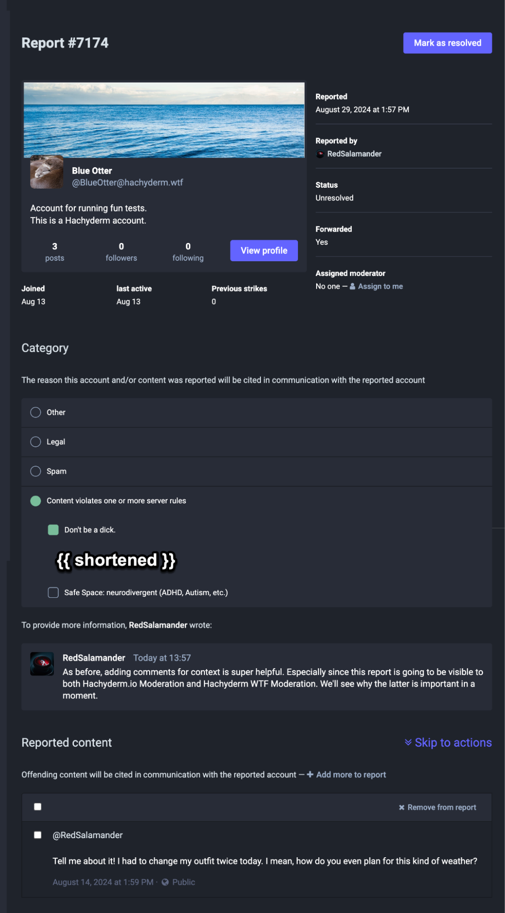

Since RedSalamander is on Hachyderm.io, the Hachyderm.io Moderators can see:

* The reporting user
* The rule violation they selected
* The comment they wrote
* The post they reported

This is the same as before.

**Hachyderm.wtf Moderation**

RedSalamander is _not_ local to Hachyderm.wtf. So the Hachyderm.wtf moderators see:

* The originating server name only, not the specific user on that server who filed the report
* They do not see the rule violation that the user selected, the report is categorized as "Other". Remote reports will always be categorized as "Other", regardless of whether the user selects a rule violation, spam, or legal.
* They _do_ see the comment that the user provided
* They _do_ see the post that was reported

We will be diving into the nuances of local vs remote as we dig further into the Report structure itself and the actions that moderators can take. The main takeaway here is that remote moderators will see less information about the reporting user and the category they select than the reporting user's home instance will. In fact, the report category will always show as "Other" no matter what is selected.

We'll be covering the structure of these reports in the next section.

Side note: since Hachyderm.wtf is testing 4.3.x right now, there are some minor layout differences between the Hachyderm.io and Hachyderm.wtf report screenshots.

### Forward report "to all"

When choosing who to file a report to, a user can send a report:

* To their own moderators only
* To the reported user's moderators only
* To all the instance moderators involved

This last option usually causes some confusion. Let's think about our test users again:

* RedSalamander on Hachyderm.io
* BlueOtter on Hachyderm.wtf
* PurpleHyacinth on Infosec.Exchange

Let's say that PurpleHyacinth on Infosec.Exchange says something problematic, BlueOtter on Hachyderm.wtf responds, and RedSalamander on Hachyderm.io reports the exchange without posting. This is what the reporting forwarding would look like:

You cannot opt-out of sending reports to your own moderators, as again local moderators see all reports. This is why Hachyderm.io is not visible here. The forwarding lists the instances of all users who are tagged in the thread of the post(s) reported.

The intent of the feature is to increase visibility of a problematic user to the moderators of all users involved in a thread rather than limiting it to only the reporting user's instance moderators and the reported instance user's moderators. This gives more moderators the ability to protect their instances from harmful content.

That said, for moderators not expecting this situation, it can be confusing to know if the report is "meant for you" and if you should action it. The short answer is that the goal is to help give you visibility into behaviors that haven't been otherwise reported to you, and that you should action it (or not) according to your existing instance policies.

## What your moderator sees in a report

**Moderators see all reports generated by their own users, regardless of whether the reported user is local or remote.** 

Moderators see all reports generated by their own users and users also have the option of sending the report onward to both the reported user's moderators and the moderators of any other instances involved in the reported posts. Involvement in this case is the home instances of the users tagged in the posts being reported.

### Anatomy of a report

(We have some documentation about [the anatomy of a Mastodon report](https://community.hachyderm.io/docs/mastodon/moderation/report-feature/) on our Community docs as well.)

So let's look at the sections. In the first section (above the Category header) the moderation team can see:

* The display name, user name with server domain, avatar, and banner image
* The date and time of the report
* If the report is local (like this one), the reporting user's handle is displayed. For a remote report, only the domain of the reporting user is displayed (as shown previously)
* The status as Unresolved or Resolved
* The report status: forwarded (local only) or not forwarded (sent to one or more remote instances)
* The ability to assign the report to themselves (you cannot assign to a different moderator)

In the Categories section, the moderation team can see:

* Other
* Legal
* Spam
* Content violates one or more server rules, and then the rules themselves
* The comment provided by the reporting user, if any

In the Reported Content section, moderators can see:

* The post(s) being reported

Note that public or followers only posts can be reported and that a user can be reported for boosting problematic content. 

For followers only / permissions limited posts: moderators can only see those posts in the report itself, they cannot view it by going to the post's URL like they can for public posts. In situations where a report was not forwarded and the moderators believe it should be, this can create a problem as moderators cannot forward a report - they can only generate a new report and choose to forward that new report to the remote moderation team. This limits moderator ability to directly forward posts with limited permissions (though they can screenshot and email the other moderation team(s)).

The actions taken and moderator comments are at the end of the report. Since the available moderation actions differ between local and remote reports, we will cover that in the Moderator Actions section.

# What users look like in the Mastodon Moderation UI

## Local Users

This is what a local user looks like in the 4.2.10 moderation interface. Here you can see:

* The full profile text (user set)
* How many posts they've made
* How many followers they have
* If they've made any reports (local or remote)
* If they've been reported (local or remote)
* If they have escalated privileges (e.g. are a moderator or administrator)
* What their registered email is
* Selected language
* Join date
* IP address(es) where they've logged in (useful for finding spam patterns / multiple accounts created)
* When they last logged in
* Their login status (this means if they're currently moderated, e.g. frozen or suspended)
* Any account notes

You can also see that moderators can take an action on an account directly, even without a report. If there had been any moderation action taken on this account, there'd be an Audit Log that would display right above the "Notes" header.

## Remote Users

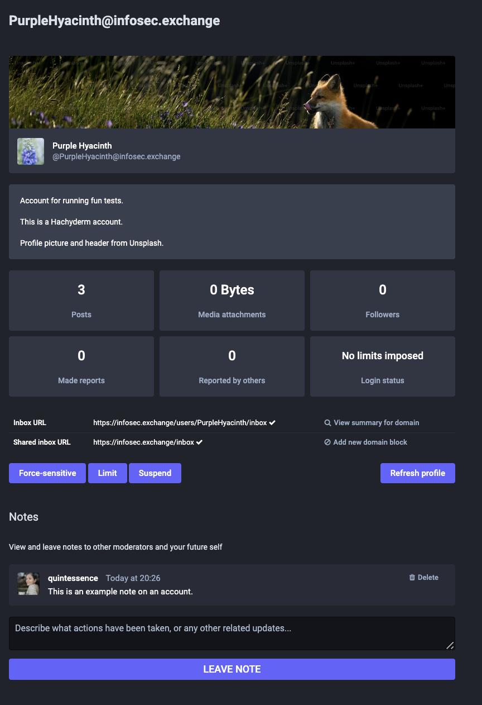

This is what a remote user looks like in the 4.2.10 moderation interface. As you can see they are _mostly_ the same, except:

* There are fewer moderation actions available
* There is no personal data (email, IP address, etc.) available

These make sense. To send a Warning, you need the ability to contact the user - which you cannot contact a remote user. To Freeze an account you're allowing a user to log in but not post, effectively, which is something you (as a moderator) can only do if you control their account.

Similar to the local user, if this user had a history where they had been moderated in the past, there'd be an Audit Log that would appear right above the Notes section.

# What the moderation queue looks like

Reports by local users show the username of the reporting user. Reports from remote users show the server, but not the user name, of the reporting user.

<table>
  <tr>
   <td>
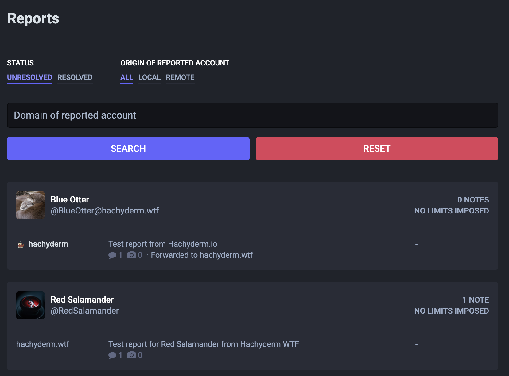

   </td>
   <td>

   </td>
  </tr>
  <tr>
   <td>Moderation queue from Hachyderm.io
   </td>
   <td>Moderation queue from Hachyderm.wtf
   </td>
  </tr>
</table>

For the purposes of this example, both reports were forwarded to the home instance. 

* In the Hachyderm.io queue, the Hachyderm user has reported the remote user BlueOtter at Hachyderm.wtf and an unknown user from Hachyderm.wtf has reported the Hachyderm.io user RedSalamander. 
* In the Hachyderm.wtf queue, an unknown user from Hachyderm.io has reported the local user BlueOtter and the local BlueOtter user has reported the remote user RedSalamander at Hachyderm.io

## How to search for reports from an instance and regarding an instance

As you can see in the above section, the moderation interface allows you to search by the domain of the reported account, which is referred to as the target domain. To put it another way, if a Hachyderm.io moderator only wanted to see reports about Hachyderm.wtf users, they would search for Hachyderm.wtf in that search box.

The moderation interface does not currently allow for you to search for an originating domain ([though work on this has started](https://github.com/mastodon/mastodon/issues/31234)). If you wanted to see all reports _from_ an instance, e.g. all reports originating _from_ Hachyderm.wtf, then you'd need to run a database query (if you're self hosting). The general query looks like this:

If the result is one or more, you can see the full URLs of the report(s) by running:

The query and output of the latter looks something like this:

Where example.com would be changed to whatever instance you want data on and both XXXX and YYYY are specific report IDs.

As far as we know you can only run these queries if you are self hosting. If you are using a Mastodon hosting provider, you will need to reach out to your provider to see if you have access to run queries like this one.

## Responding to requests for information

The only searchable information for reports at this time are the source and target domains. Basically, as a moderator you can answer the following very quickly:

* Our users have made N reports _about_ users on Instance A and we have received M reports _from_ Instance A about our users.

You cannot, however, determine how many reports have violated a specific server rule or that were marked as Other, Legal, or Spam. There also isn't a way to provide additional tags to a report so they're searchable by shared vocabularies, such as provided by [IFTAS's Shared Vocabulary List](https://connect.iftas.org/library/iftas-documentation/shared-vocabulary-labels/). (You **_can_** do this with your Blocklist / Moderated servers list, which will be discussed in a later post.)

As a moderator, make sure you **set reasonable expectations** with whomever is requesting information regarding what information you are able to share both due to what the platform allows you to find and what you are allowed to share under your terms of service, privacy rules, any regulations, etc.

# What actions a moderator can take on a report

## Moderation actions for **_local_** users

<table>
  <tr>
   <td>
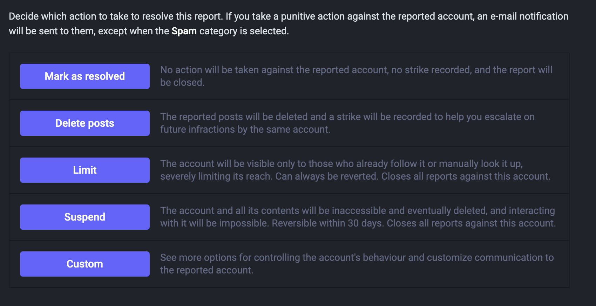
   </td>
   <td>
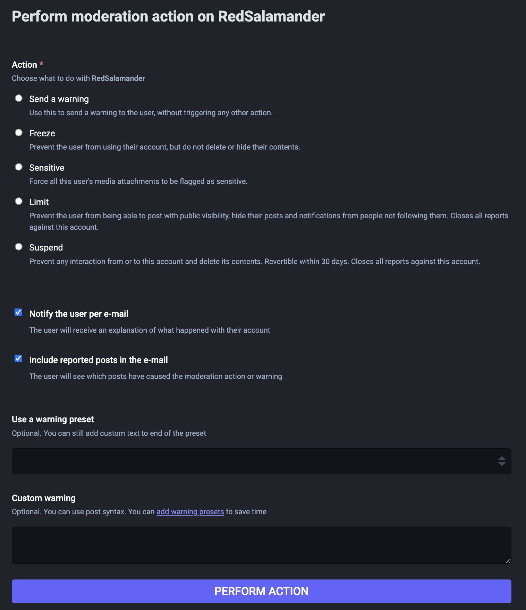

   </td>
  </tr>
  <tr>
   <td>Default actions
   </td>
   <td>Custom actions
   </td>
  </tr>
</table>

You'll notice that there are some actions that can be either Default or Custom. Some actions are Default only and some actions are Custom only. In both cases a moderator can compose a custom message to the moderated user to explain the reason the action was taken. To quickly overview the actions:

* Mark as resolved: this closes a report with no action.
* Delete posts: deletes the reported posts
* Limit: does not sever any follower/following relationships, does limit post and account visibility
* Suspend: deletes the user (data is still in the system for 30 days)
* Warning: sends a message to the user
* Freeze: Allows the user to log in, but not post
* Sensitive: Marks all media posted by the user, images or video, as sensitive 

On the Custom actions view, you can also see the option to use "warning preset". This is another way to refer to canned messages. Basically if you are, as a moderator, sending the same message or messages with your moderation actions, you can create presets so you're not typing them every time. Canned messages can only be accessed in the UI by navigating to a custom action (like in the screenshot) and clicking the "add warning presets" link under the Custom warning label. Alternatively, you can access them by the `admin/warning_presets` endpoint (e.g. `example.com/admin/warning_presets` ). 

### A quick example

Let's take a look at what happens when you Limit an account in a report both either as a Default or Custom action.

**Limit: Default action**

<table>
  <tr>
   <td>
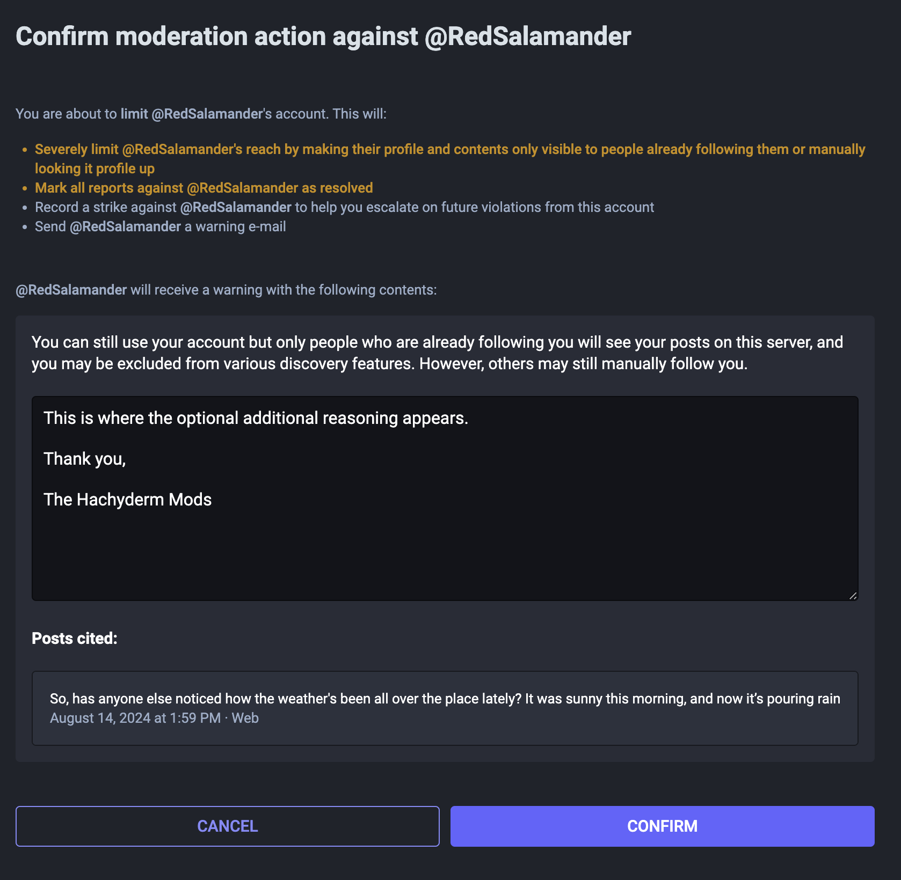
   </td>
   <td>
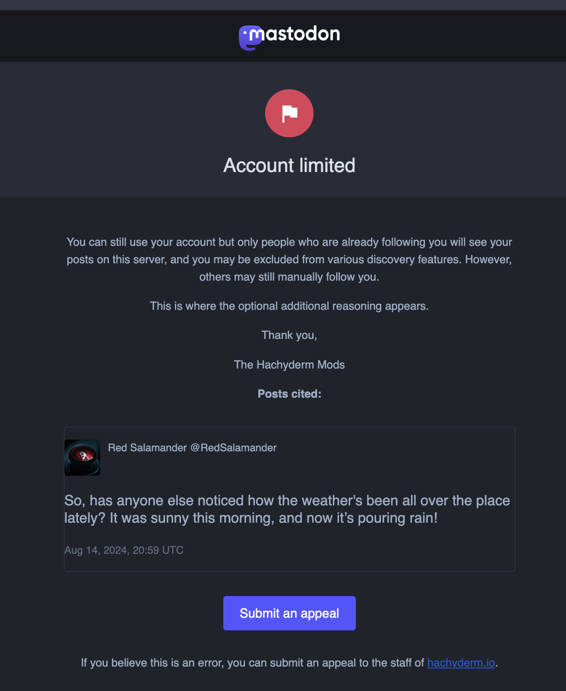
   </td>
  </tr>
  <tr>
   <td>This is what the moderator composes
   </td>
   <td>This is what the user receives
   </td>
  </tr>
</table>

**Limit: Custom action**

<table>
  <tr>
   <td>
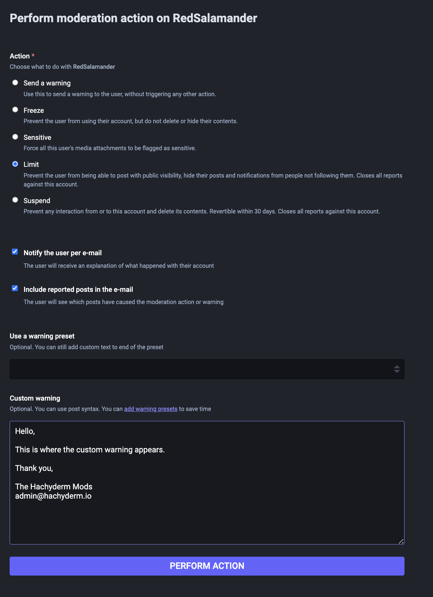
   </td>
   <td>
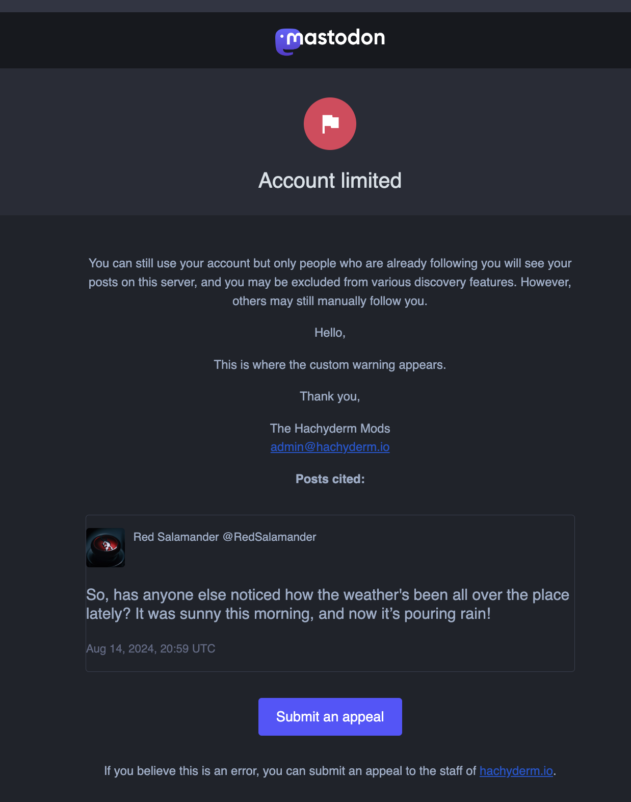
   </td>
  </tr>
  <tr>
   <td>This is what the moderator composes
   </td>
   <td>This is what the user receives
   </td>
  </tr>
</table>

As you can see, in both cases the user receives the same email. So from a custom messages standpoint, you are able to send custom messages either using Default or Custom.

## Moderation actions for **_remote_** users

<table>
  <tr>
   <td>
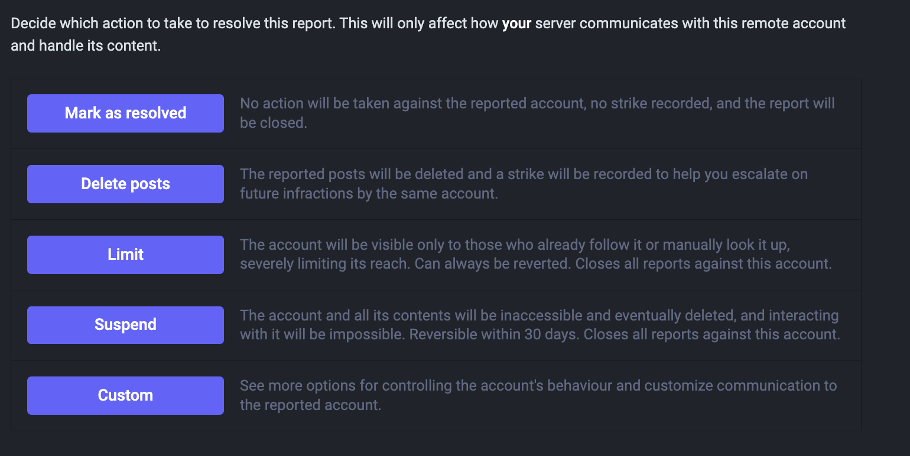
   </td>
   <td>
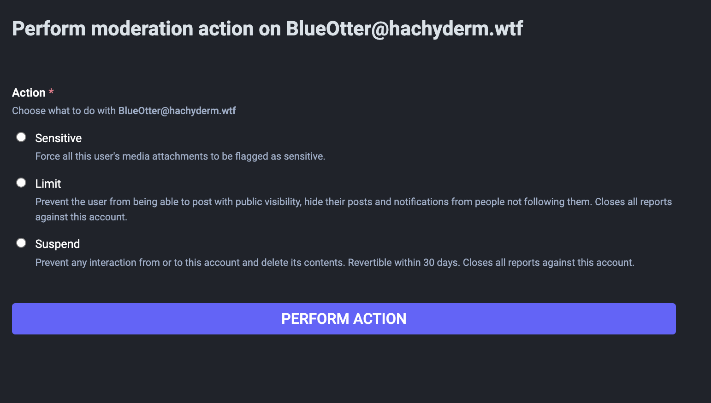
   </td>
  </tr>
  <tr>
   <td>Default actions
   </td>
   <td>Custom actions
   </td>
  </tr>
</table>

The actions available for moderating remote users is similar, but not identical, to local users:

* Mark as resolved: this closes a report with no action.
* Delete posts: makes the posts not visible to your instance
* Limit: does not sever any follower/following relationships, does limit post and account visibility
* Suspend: defederates from the individual user
* Sensitive: Marks all media posted by the user, images or video, as sensitive 

Note that **_neither remote users nor their moderators are notified_** of moderation action(s), so there are not options to send warnings or custom messages. There will be more about communications in the next post.

# Moderation notifications are heavily restricted as moderation is confidential

**The only way to know if any moderation action was taken on a report is to follow up with the moderator team or teams involved.**

Something we want to directly call out is that a Mastodon Moderation Report is not like a "report ticket", similar to some customer service platforms and/or Facebook support. This means that the following do **_not_** exist in platform:

* The user who created the report is **_not_** notified that it was sent, opened, actioned, or closed. This is not due to moderators opting in or out of this communication.
* The reported user will **_not_** see any reports generated against them, no matter how many there are or their sources (local, remote). Again, this is not due to a setting that users have or that moderators make for an instance.
* The **_only time_** a **_local_** user is notified is when their moderators take a moderation action (like sending a warning, limiting, etc.). They are **_not_** notified about the reports themselves.
* If the reported user is a **_remote_** user, they are **_not_** notified about anything at all. To be explicit: they are not notified when a report is generated and they are not notified about moderation actions taken.
* Remote moderators **_are not notified_** if another instance takes moderation action against one or more of their users. This is because user roles are not federated, all remote users are simply users. (For those that note that on some instances labels like "Owner" or "Admin" or "Mod" appear on a user's profile: this is not federated. This is only displayed on the user's profile.)
* Instance moderators **_only_** see their own report queue and information. There is no way for a remote user, even if they are a moderator, to see another instance's report queue (to know what was sent to them) or know what actions were taken. They can only request this information from the other instance's moderators.

This means that:

* No one has information about an instance's moderation process besides that instance's moderators, not even remote moderators or the user(s) who filed the report(s).
* So if you suspect you may have been moderated by a remote instance, you will need to reach out to that moderating team specifically.
* You can contact your own moderating team if you wish to have them relay a request on your behalf if that adds comfort and/or reduces stress. That said, to state it again, since role information is not federated they cannot answer questions directly as they don't have any additional visibility to remote situations.

We will be covering moderation communication strategies in our next post.

# Not all report data is stored permanently

**Any change that results in a removal of data (delete post, suspend) causes that report data to be purged after 30 days.**

The reason for this makes sense when you understand how posts are included in a report:

**Posts are not "copied into" or "stored in" a report - they are linked.**

Understanding this helps when trying to understand how reported posts persist, or not, in the report itself. Whenever a post is deleted after it is reported, no matter whether by a moderator or the user, it looks like this:

<table>
  <tr>
   <td>

   </td>
   <td>
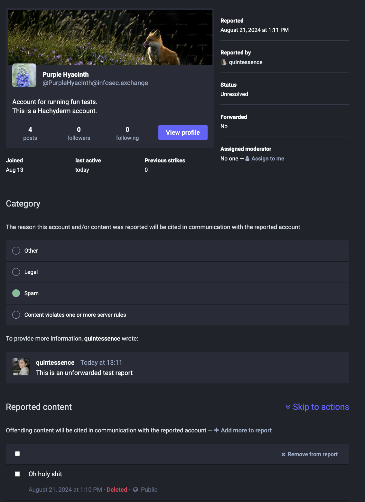
   </td>
  </tr>
  <tr>
   <td>Report with post prior to user deleting post
   </td>
   <td>Report with post after user deleting post
   </td>
  </tr>
</table>

30 days after the post is deleted it is removed from the report entirely. In this case, that means **_this report will appear blank after 30 days._**

In the case where a user is suspended, the posts in the report would not show the red "deleted" text, the posts will stay in the report for the short term, but will still be deleted and therefore **_the report will also be blank after 30 days._** (Suspended in this case means both when a local user is suspended and their account information is deleted after 30 days and when a remote user is defederated from.)

# Report data cannot be aggregated by moderators

Usually more than one person sees a problematic post, what does this look like in the moderation queue?

Mastodon's moderation interface has reported posts aggregated by user - regardless of the source of the report or the post or posts being reported. It looks like this:

At a glance, which of BlueOtter's posts do you think are in these reports? Let's take a look from the perspective of a Hachyderm moderator. 

Here are the two reports originating from the Infosec.Exchange instance:

<table>
  <tr>
   <td>
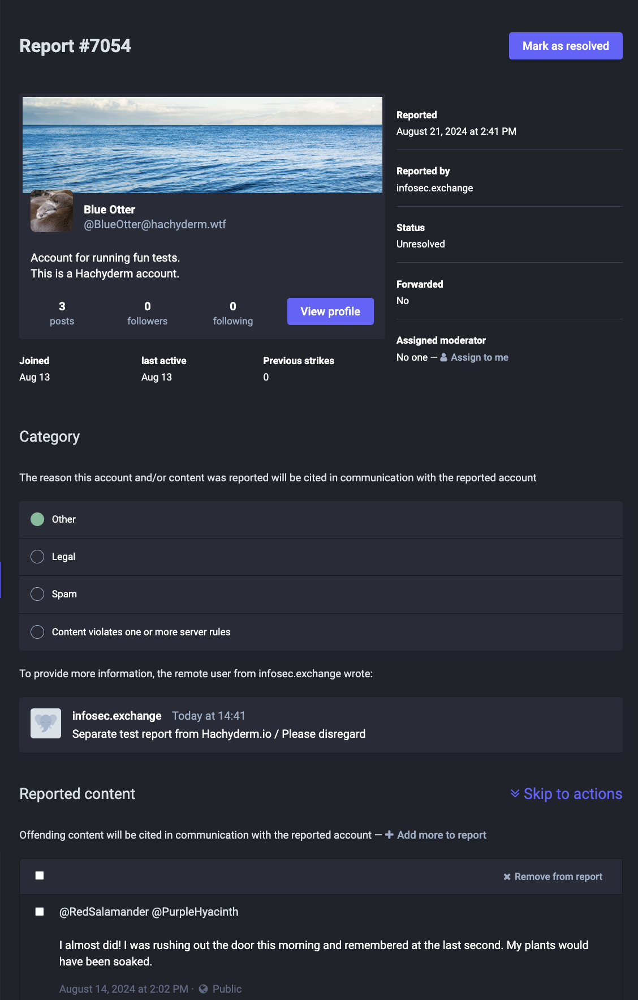
   </td>
   <td>

   </td>
  </tr>
  <tr>
   <td>First report from Infosec.Exchange
   </td>
   <td>Second report from Infosec.Exchange
   </td>
  </tr>
</table>

And now let's look at the one generated locally by the Hachyderm user:

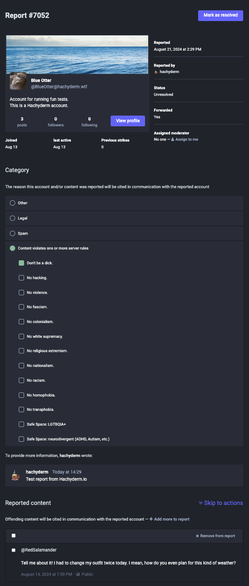

Here we can see that:

* The two Infosec.Exchange reports **_are not_** about the same post
* One of the Infosec.Exchange reports and the only Hachyderm.io report **_are_** about the same post

Something you may have noticed, that was also pointed out earlier in this post, is that both remote reports are categorized as "Other". This is because the report type is not federated (for those familiar / to be explicit: the report category and rule violations are not federated with the Flag activity.)

As a moderator, you should expect **_all of your remote user generated reports to be categorized as Other_**. This is especially noteworthy if you're running your own self hosted instance, as there are no local users (other than you), so in your case **_all_** of your reports will show as Other.

### Moderators have some control over report categories

Moderators **_can_** change the report category. So if the report category needs to be changed, or set in the case of Other, this is something moderators can do.

Moderators **_cannot_** create new categories outside of the ones automatically generated as Rule violations. If you want to change the rules that are listed under Rule Violations, you must change the server rules at `admin/rules`. (If you are a moderator this is under Administration → Server Rules.) This means that the only categories that you can use are one of Other, Legal, Spam, or one or more Rule Violations. You cannot select more than one top-level category.

### Moderators cannot analyze report data

**Only the reporting (source) and reported (target) domains are searchable. No other data is searchable.**

We stated this earlier, but wanted to repeat ourselves for a moment while we're talking about changing report categories and moderator notes.

Moderators can use common vocabulary, like [IFTAS's Shared Vocabulary list](https://connect.iftas.org/library/iftas-documentation/shared-vocabulary-labels/), in their moderator comments. They can also choose to include other data, like demographic information regarding the report, in the moderator notes. This information is helpful when reviewing individual reports.

That said, Mastodon Reports cannot be searched by anything other than the reporting (source) or reported (target) domains. You cannot search or otherwise analyze data about Report categories or keywords (tags) used in moderator notes. You cannot search for individual report IDs either, though you can use them directly if you know the ID of the report you're looking for by going to `admin/reports/XXXX`. 

Make sure to set expectations about what questions are or are not answerable, not only by whatever moderation policies you have around disclosing user information but also around what you can use the tools to find.

For some Hachyderm specific information relevant to this section:

* We will not release individual moderation information or user data to others. 
* A consequence of this is if there's a situation where 2 or more users are moderated in an interaction, each user will only know what we're asking of _them,_ not anyone else involved. If there are enough users interacting in a situation where we are able to answer questions about the situation without calling out an individual user, we can disclose information such as "multiple users were moderated in this situation" and/or "we have temporarily moderated multiple users to enforce a cool down period".
* We will, to the best of our ability, answer questions about reports. Our answers will usually be about general policies, in part due to the inability to surface category / type information about reports.
* We are willing to revisit moderation decisions when moderated users (or instances) reach out.

### Some limitations for how reports are aggregated in the moderation queue

To put them in one spot, here are some of the limitations that we've covered for how the report feature and queue work today (Mastodon v4.2.10):

* Remote reports will always come through as Other, regardless of what the reporting user selects.
* Moderators can change the category of a report.
* Multiple reports about the same post are separate and cannot be consolidated.
* As a result, "one issue" may look like "many issues" (multiple reports on the same topic) or "many issues" may be "one issue" (multiple contexts in one report).
* Reports cannot reference each other. (For those familiar with GitHub, this would be similar to tagging a PR, Issue, etc. in comments and now you can see each PR or Issue from all the other PRs and Issues. For those unfamiliar with GitHub, [you can see an example of this on Mastodon's GitHub Issue # 31083](https://github.com/mastodon/mastodon/issues/31083).)
* Reports cannot be aggregated by the instance the reported user(s) are on (e.g. if you wanted to track if multiple reports are coming in for multiple users on the same instance).
* Reports cannot be aggregated to track a user that is creating multiple accounts on separate servers, typically referred to as sock accounts. (e.g. if you wanted to track sock accounts of a specific individual who is engaging in harassment)
    * Important clarification: sock accounts _are not_ the same as people who park user names on various instances.
* Reports cannot be forwarded from the moderation queue. So if a user has chosen to report to their local moderators only, and the local moderators decide it should be forwarded to the other server, they need to generate a new moderation report to forward to the remote moderation team. 
* If the report contains one or more posts where a user is abusing the "Followers Only" feature of Mastodon, that report cannot be recreated as the moderators cannot see those posts to report. They will need to contact the remote moderation team through one of their contact methods.

# Strategies for report data

In order to store moderation report data for greater than 30 days or to put information from multiple sources into one place, you will need to use some sort of third party tool. What tool or tools you use will depend on complexity and how much data you need to include.

* For simple reports, you may want to copy the plain text of the reported posts into the moderator comments. This way if you are asked about the reports past the 30 day mark, you can still see the original text even if the posts were removed and/or the user was deleted. (For 4.3.x - the report comment field is being expanded from 500 characters to 2000, so this will be even easier to do.)
* For more complex reports (such as issues that have multiple reports and/or corresponding emails to one or more parties) you will need to use some sort of documents that have access controls on them. Depending on your needs, Google Docs or GitHub's Wiki on a private repo could work here.
* Google Docs and/or a GitHub Wiki or similar is _also_ useful if your moderation team is generating their own report data or making / maintaining intelligence data about bad actors or instances on the Fediverse. Examples can include things like instances hosting illegal content or users that are making sock accounts across instances.

# A quick hat tip to Mastodon v4.3

Although this post, and the rest of the posts in this series, are being written for 4.2.10 (and potentially 4.2.12), we want to acknowledge that there are feature changes that will be appearing in 4.3.x when it is released. For more information about which features, please follow [mastodon/mastodon releases on GitHub](https://github.com/mastodon/mastodon/releases). 

# A very, very quick summary of this post

* Mastodon moderation reports are a part of the process that allows moderators to maintain community safety.
* There are limitations to what information is available and to whom.
* While local moderators see all outbound reports, there are limits to what inbound reports may be sent in.
* Not all reports are directly actionable by a local moderation team, especially if it is a remote user who was reported. Moderators can contact the reported user's moderation team for action.
* Moderators can contact their own users in-platform but not remote users or moderators.
* Moderators can determine how many reports have been filed from/about an instance, but not about what category.
* Moderators can determine what reports were filed by or file about an individual user via their user profile in the moderation UI.
* Moderators cannot directly forward reports to remote moderators but can generate new reports if they believe the report should be sent and it wasn't forwarded by the reporting user.
* Moderators should have a firm understanding of what data they can pull from the moderation platform and what information their policies allow them to share, so they can set expectations on information requests.

# What's next: tools to communicate about moderation issues

This post focused on the mechanics of how reports are generated, what information they display, and what actions moderators can take. Many users and moderators also need the ability to communicate with each other to ensure that the moderation process is beneficial to communities and does not itself introduce additional harm.

After that post, we'll be providing another context setting post before moving on to the next sections of the moderation UI (order still being determined).

### Licensing 

Our blog posts and documentation are all under the [CC-BY-SA 4.0 license](https://creativecommons.org/licenses/by-sa/4.0/deed.en), so please feel free to use and attribute them as needed.
