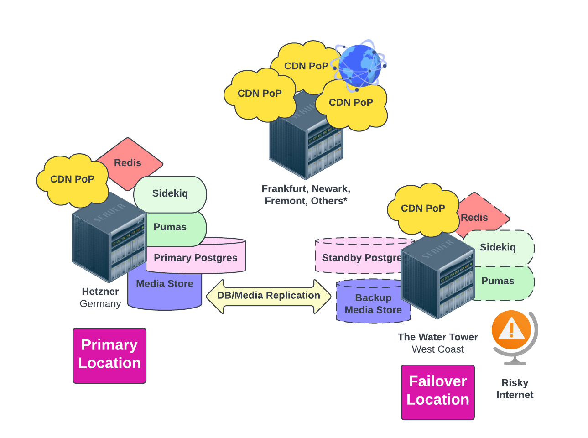

{}
This page is still being built. Check back often.
{}

Hachyderm is taking the first steps towards what we are calling **Open Source Infrastructure** which is where we intend to operate a secure and resilient service completely in the public.

## Hachyderm Today

Today Hachyderm runs a global topology that is distributed across the following service providers:

 - On premise servers in Seattle, Washington also known as "The Watertower".
 - Small lightweight [Linode](https://www.linode.com/) VMs operating around the world.
 - Core infrastructure operating in [Hetzner](https://www.hetzner.com/) in Falkenstein, Germany.
 - Object storage sponsored by [Digital Ocean](https://www.digitalocean.com/products/spaces).

### Experimenting in the Public

Hachyderm deeply believes there is untapped value left in computer science. We intend on approaching our infrastructure as an opportunity for safe and thoughtful experiments, similar to how the [International Space Station conducts experiments in orbit](https://www.nasa.gov/mission_pages/station/research/experiments_category). We intend on prototyping new technology, operational models, SRE organizational structure, follow-the-sun patterns, and open source collaborative workstreams for our infrastructure. In the coming months we will be sharing ways in which the broader Hachyderm community can volunteer to support our infrastructure, as well as register hypothesis backed experiments to run with our data and our services. 

Your user data will never be leveraged for an experiment. All user profile data, direct messages, post content, access metrics, demographic detail, and personal information will be restricted from any form of experiment. To be even more direct about, you, as a Hachyderm user will never be leveraged in an experiment. We will not be experimenting on you. We are experimenting on the tools and services that support hachyderm's public services such as prototyping databases, HTTP(s) servers, and compute runtimes.

### Meet The Team 

 - [Kris Nóva](https://hachyderm.io/@nova)

