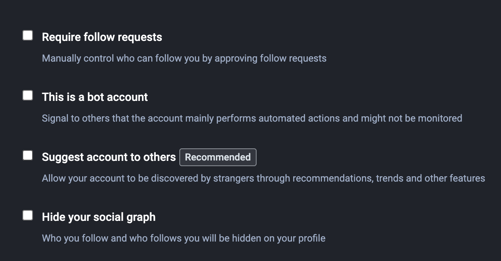

Bots come in a wide variety of frequencies and topic spaces. To
limit which bot accounts are posting on our server, bot accounts
must be approved to join.

FIXME - add detail, require covenant

## Bot Account Posting Rules

- All bots must select the bot checkbox in their profile settings 
- Bots are required to put the `#hachybots` hashtag in _all_ posts so
  users can opt into, or out of, bot posts.
- Bot accounts are limited to **_5 automated/curated posts per day_**. Bots may respond directly to posts that they have been tagged in.
- Reactionary bots may only be trigged by posts that include their handle.
- Reacting to hashtags, keywords, etc. without being tagged is not permitted - e.g. bots that respond to user posts based on keywords and similar.
- **_Bots that violate rules about spam, fundraising, 18+, corporate, etc.
  account types will be suspended._**

