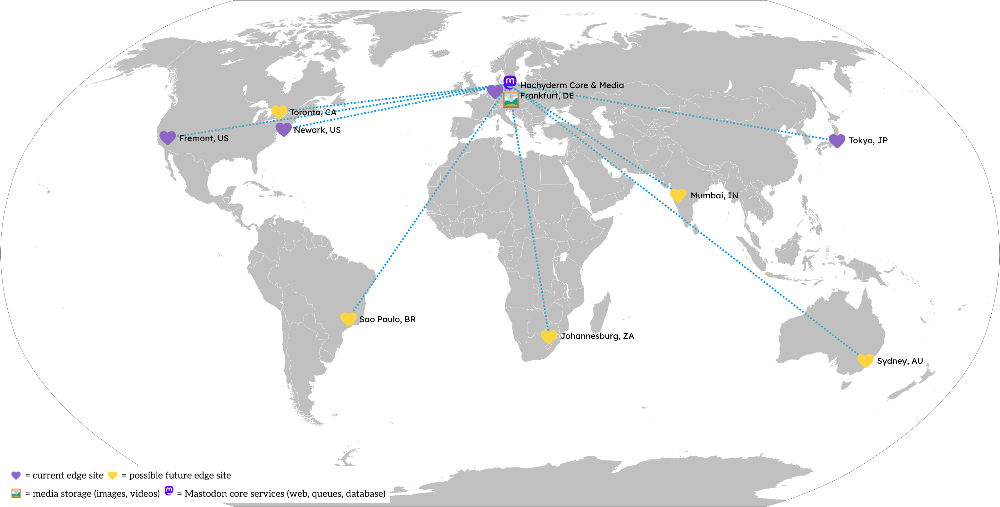

{}
This page is missing a lot of details - we'll be publishing more in November/December of 2024.
{}

## Footprint

Today Hachyderm runs a multi-cloud, global topology that is distributed across the following service providers:

 - **Edge node "CDN"** - small, lightweight [Linode](https://www.linode.com/) VMs operating around the world. These serve as the front door to Hachyderm and allow us to cache content close to where our users consume it.
 - **Mastodon Core** - physical machines operating in [Hetzner](https://www.hetzner.com/) in Falkenstein, Germany.
 - **Media Storage** - media (images, videos, audio, etc.) storage hosted in DigitalOcean's [Spaces S3-alike](https://www.digitalocean.com/products/spaces) service.

 The disparate clouds are linked together using [Tailscale](https://tailscale.com) to create a resilient, secure global virtual private network.

### Components

Key components of our tech stack include:

- [Mastodon](https://github.com/mastodon/mastodon)
- [Arch Linux](https://archlinux.org/) and [Debian](https://www.debian.org/)
- [systemd](https://systemd.io/)
- [Ansible](https://www.ansible.com/)
- [postgresql](https://www.postgresql.org/)
- [ElasticSearch](https://www.elastic.co/elasticsearch)
- [Redis](https://redis.io/)
- [Nginx](https://nginx.org/)
- [Terraform](https://www.terraform.io/)
- Multi-cloud networking via [Tailscale](https://tailscale.com)
- Deployment pipelines that enshrine safety to yield speed and agility
- General cloud engineering and SRE patterns & practices
- Experience with any cloud provider, in particular: [Linode](https://linode.com), [Hetzner](https://hetzner.com), [DigitalOcean](https://digitalocean.com)

(Notice we **didn't** say [Kubernetes](https://kubernetes.io) -- we don't currently use it, nor plan to!)

## Experimenting in Public

Hachyderm deeply believes there is untapped value left in computer science. We intend on approaching our infrastructure as an opportunity for safe and thoughtful experiments, similar to how the [International Space Station conducts experiments in orbit](https://www.nasa.gov/mission_pages/station/research/experiments_category).

We intend on prototyping new technology, operational models, SRE organizational structure, follow-the-sun patterns, and open source collaborative workstreams for our infrastructure. In the coming months, we will be sharing ways in which the broader Hachyderm community can volunteer to support our infrastructure, as well as register hypothesis backed experiments to run with our data and our services. We are experimenting on the tools and services that support Hachyderm's services such as prototyping databases, HTTP(s) servers, and compute runtimes.

### ... but *never* for AI

The Hachyderm team will **never** use your user data in an experiment, including for the purposes of training LLMs/AI models.

To be even more direct: you, as a Hachyderm user will never be leveraged in an experiment. We will not be experimenting on you. All user profile data, direct messages, post content, access metrics, demographic detail, and personal information will never be used in any form of experiment. 

## Volunteering

If you're interested in volunteering, read more [here](https://github.com/hachyderm/community/discussions/590).

## Infrastructure Placement & Supporting Tools

<table>
  <tr>
   <td>
<strong>Component</strong>
   </td>
   <td><strong>Asset Location(s)</strong>
   </td>
   <td><strong>Provider(s) & Country</strong>
   </td>
   <td><strong>Services Provided</strong>
   </td>
  </tr>
  <tr>
   <td>Edge CDN
   </td>
   <td>
<ul>

<li>US - California and New Jersey</li>

<li>DE - Frankfurt</li>

<li>JP - Tokyo</li>

<li>(further expansion planned soon)</li>
</ul>
   </td>
   <td>US - Akamai
   </td>
   <td>
<ul>

<li>Virtual Machines</li>

<li>Network Backbone</li>
</ul>
   </td>
  </tr>
  <tr>
   <td>Mastodon Web
   </td>
   <td>
<ul>

<li>DE - Frankfurt</li>
</ul>
   </td>
   <td>DE - Hetzner
   </td>
   <td>
<ul>

<li>Virtual Machines</li>

<li>Network Backbone</li>
</ul>
   </td>
  </tr>
  <tr>
   <td>Mastodon Sidekiq (Queues)
   </td>
   <td>
<ul>

<li>DE - Frankfurt</li>
</ul>
   </td>
   <td>DE - Hetzner
   </td>
   <td>
<ul>

<li>Virtual Machines</li>

<li>Network Backbone</li>
</ul>
   </td>
  </tr>
  <tr>
   <td>Mastodon Redis
   </td>
   <td>
<ul>

<li>DE - Frankfurt</li>
</ul>
   </td>
   <td>DE - Hetzner
   </td>
   <td>
<ul>

<li>Virtual Machines</li>

<li>Network Backbone</li>
</ul>
   </td>
  </tr>
  <tr>
   <td>Mastodon Streaming
   </td>
   <td>
<ul>

<li>DE - Frankfurt</li>
</ul>
   </td>
   <td>DE - Hetzner
   </td>
   <td>
<ul>

<li>Virtual Machines</li>

<li>Network Backbone</li>
</ul>
   </td>
  </tr>
  <tr>
   <td>Mastodon Postgresql (Database)
   </td>
   <td>
<ul>

<li>DE - Frankfurt</li>
</ul>
   </td>
   <td>DE - Hetzner
   </td>
   <td>
<ul>

<li>Virtual Machines</li>

<li>Network Backbone</li>
</ul>
   </td>
  </tr>
  <tr>
   <td>Observability Metrics & System Logs
   </td>
   <td>
<ul>

<li>DE - Frankfurt</li>
</ul>
   </td>
   <td>DE - Hetzner
   </td>
   <td>
<ul>

<li>Virtual Machines</li>

<li>Network Backbone</li>
</ul>
   </td>
  </tr>
  <tr>
   <td>Mastodon Media Storage
   </td>
   <td>
<ul>

<li>DE - Frankfurt</li>
</ul>
   </td>
   <td>US - DigitalOcean
   </td>
   <td>
<ul>

<li>S3-compatible Storage</li>
</ul>
   </td>
  </tr>
  <tr>
   <td>Observability Traces
   </td>
   <td>
<ul>

<li>US</li>
</ul>
   </td>
   <td>US - Honeycomb
   </td>
   <td>
<ul>

<li>Honeycomb OTel Ingestion</li>
</ul>
   </td>
  </tr>
  <tr>
   <td>Connectivity Mesh
   </td>
   <td>
<ul>

<li>Various - present on all Hachyderm VMs</li>
</ul>
   </td>
   <td>CA - Tailscale
   </td>
   <td>
<ul>

<li>Virtual Encrypted Network</li>

<li>Machine Identity & Tagging</li>
</ul>
   </td>
  </tr>
  <tr>
   <td>Code Version Control
   </td>
   <td>
<ul>

<li>US - Washington + Virginia</li>
</ul>
   </td>
   <td>US - Github/Microsoft
   </td>
   <td>
<ul>

<li>Git Source Control</li>
</ul>
   </td>
  </tr>
  <tr>
   <td>Secrets Management
   </td>
   <td>
<ul>

<li>US - North Virginia</li>
</ul>
   </td>
   <td>CA - 1Password
   </td>
   <td>
<ul>

<li>1Password Vault</li>
</ul>
   </td>
  </tr>
</table>

## Historical Archive

Here's our "v2" infrastructure diagram from circa November 2022:

## Infrastructure Contributors

Some contributors have opted to remain anonymous. Thank you to all our volunteers past & present!

- <a href="https://hachyderm.io/@esk" rel="me">@esk@hachyderm.io</a>
