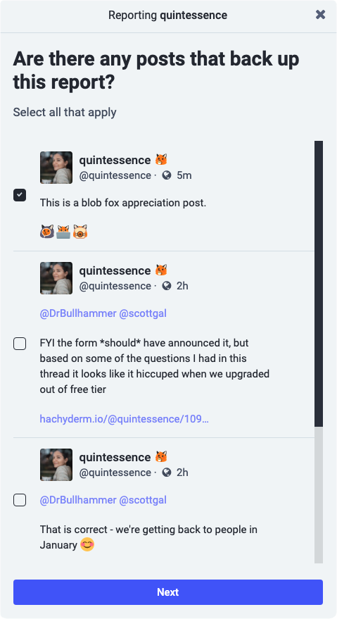
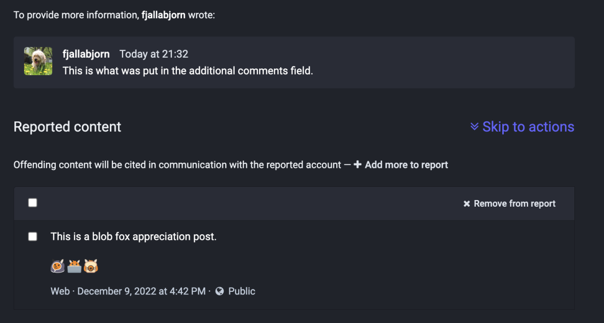

{}
This section documents features and processes maintained by Mastodon. For
issues related to these features and/or processes, please reach out to the Mastodon team
directly on [the Mastodon project's GitHub](https://github.com/mastodon/mastodon).

For issues with this doc page itself, please reach out to us on
[Hachyderm's Community Issue tracker](https://github.com/hachyderm/community/issues).
{}

## Overvew <!-- omit in toc -->
- [About the Report Feature](#about-the-report-feature)
- [How to create a report](#how-to-create-a-report)
- [What a Filed Report Looks Like](#what-a-filed-report-looks-like)
    - [Who can see moderation reports](#who-can-see-moderation-reports)
    - [Limitations of the Mastodon Admin Interface](#limitations-of-the-mastodon-admin-interface)
    - [One Last Reminder](#one-last-reminder)

## About the Report Feature

Mastodon's report feature is a way for Mastodon users to send reports to
a Mastodon instance's admins or moderators. If you are reporting a user to your own
instance's moderators, then only they will see the report. If you are reporting
a user on a remote server, then your home instance's admins still see the report.
In the case of a remote user, you can also choose whether or not to forward
the report to that instance's admins. The nuance here is capturing whether you
are reporting a user to their own home instance for their admins to take action,
to your own instance admins for them to take action, or both.

On Hachyderm, we specifically request Hachydermians to use the report feature for the
following scenarios:

* Reporting individual posts but not the user overall
* Reporting a user via their posts
* Reporting a domain via the posts of a user on that domain

When submitting a report, it is important to include all relevant information.
This includes supporting information, **_even if it seems obvious_**, any relevant 
posts as needed, as well as comments supplied by you.

**_Please note: if we receive an empty report and cannot see a
clear cause, we will close the report without moderator action._**

For more information about this, please see our [doc on Reporting Issues and Communicating with Moderators](../../../moderation/reporting/).

## How to create a report

1. Click on the meatballs(⋯) menu below the post and select
"report"  

1. Select why you're reporting. 

1. If you selected Server Rules for the reason, as we did in this
   example, then you'll be asked to select which and can select
   more than one: 

1. Please select any and all additional posts to include in the
report 

1. Please include all relevant context to help us
   process the report: 

1. You can **optionally** choose to unfollow, mute, or block
   the user before you click "Done". 

The Additional Comments step is very important. To help us process reports
efficiently there should _always_ be additional context in the
Additional Comments field - the more the better. This should be done
**_even if the report seems self-explanatory_**. In the case of
reports of posts, users, and domains that are in languages other
than English, we will need an English translation supplied.

The most important limitation you should know at this stage is
that the Additional Comments field has a character limit of 1000
characters (as of this writing). If you need to supply more
context, or the translation takes more than 1000 characters,
please:

* File the report with what you can
* Make sure to leave enough space to tell us there is a
  supplementary email
* Email us at [admin@hachyderm.io](mailto:admin@hachyderm.io)

## What a Filed Report Looks Like

For an example, I had Björn's user create a report against my Blob
Fox Appreciation Post that I used for the screenshots above. When
a member of the moderation team reviews the report, it looks like
this:

Since that is a very zoomed out view, let's look at each of the
sections. At the top is the same user information you'd see if you
navigated to the top of a user's profile page:

This section also shows the moderator team why the report was
filed, in this case the "Don't Be A Dick" rule is selected.

Underneath that is the comment that the user supplied when they
filed the report as well as all the posts they selected to include
with it. If the user is a Hachydermian, the user name is
supplied as you can see here. If the user is off our server, only
the source server is supplied.

At the bottom is the section where moderators can leave comments
and choose what action to take:

Moderators can choose to close the issue with only an explaining
comment, or to take one of the shown actions and close the issue.
For visibility, the moderation actions are:

1. Mark as Resolved (No moderator action)
1. Delete posts (Moderator resolves by deleting the offending
post(s))
1. Limit (Formerly known as "silence". The user can still
participate but they will not show in Local or Federated feeds.)
1. Freeze (User can log into their account but cannot interact.)
1. Warn (Moderators send a note through the interface to the
reported user. Note this option is not visible on the screenshot.)
1. Suspend (Also known as "ban". If the user is a Hachydermian
then their account is removed from our server. If they are on a
different server that user is banned from interacting with our
server.)

Of the above actions, the only moderation actions that are visible
are if a moderator deletes a post or suspends an account. When an
issue is closed without action or when a user is warned, frozen, or
limited, the action is not visible to the reporting user or other
users. This means that we / your instance moderators may have taken
action as the result of your report, but that action is not
publicly visible.

Please look at [our Actions and Appeals doc](../../../moderation/actions-and-appeals/)
for more information about how we use the moderation tools to
moderate Hachyderm.

#### Who can see moderation reports

If you are reporting a user on the same instance as you are (local user):

* The instance moderators can see your report

If you are reporting a user _not_ on the same instance as you are (remote user):

* Your instance moderators can see your report
* Remote instance moderators / the moderators for the reported user's instance can
  only see the report if you forward the report.

Regular users do **_not_** have access to moderation reports.

#### Limitations of the Mastodon Admin Interface

When we receive a report in the admin tools, there are two main
drawbacks:

* We cannot follow up with the reporting user to ask for
  additional information
* We cannot follow up with the reported user, even if they file an
  appeal

How this impacts you:

* If you are reporting an issue and do not include enough
  information and/or a way for us to get in touch with you to
  clarify, we might not be able to take the appropriate action.
* If you are appealing a moderation decision and do not include
  enough information for us to make a decision and a way to
  contact you, we might not have enough information to reverse the
  decision and no way to request more information from you.

#### One Last Reminder

**_If we receive an empty report and cannot see a
clear cause, we will close the report without moderator action._**
