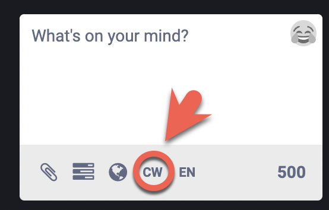
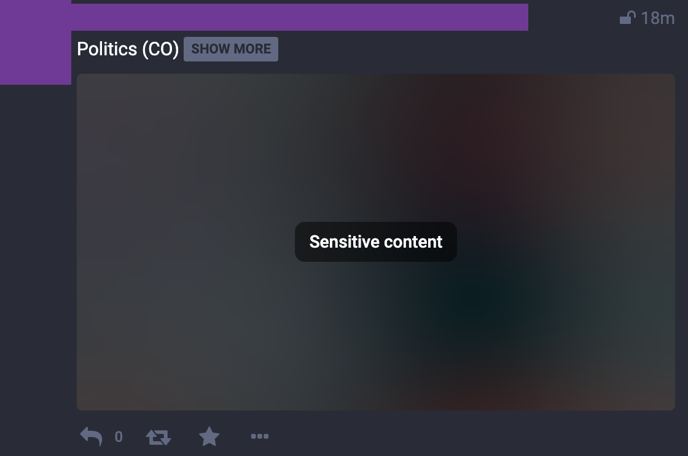

FIXME - all the following content and possibly description. 
FIXME - check all links - need to be to docs and not Markdown files

{}
This page documents features and processes maintained by Mastodon. For
issues related to these features and/or processes, please reach out to the Mastodon team
directly on [the Mastodon project's GitHub](https://github.com/mastodon/mastodon).

For issues with this doc page itself, please reach out to us on
[Hachyderm's Community Issue tracker](https://github.com/hachyderm/community/issues).
{}

## What are Content Warnings?

Content warnings are a feature that allows you to
obscure your content in such a way that it is hidden by default in other
users' timelines. Instead, only the text of the content warning is
displayed. To put it another way, if you were to put a content warning on
one of your posts that read "descriptions of war violence" while discussing
current or past wars, users would only see that description and could then
choose to click through the content warning to view the content (or not).

## How to Apply a Content Warning

In order to apply a content warning use the "CW" in the post field:

An example post with a content warning on the text and image looks like
this:

## When to Use Content Warnings

Since the content warning feature is a bit different than Twitter, there
can be confusion about when to use them. To help,
here are some general guidelines.

* A content warning should be used to protect the psychological safety of
  others in a responsible way
* Spoilers

The latter is quickest to explain, so let's start there.

--- FIXME : refactor everything below this

### "Spoilers, Sweetie"

(Quote attributed to River Song of Doctor Who fame.)

Preventing the spread of spoilers is an excellent "off label" use of the
content warning feature. Spoilers most commonly refers to current books,
television, and movies. One quick, easy example would be using a content
warning when discussing Game of Thrones when it was actively airing.
Another would be discussing the results of a football / soccer match that
people maybe haven't been able to catch up on yet. Different fandoms have
different expectations for how long information is new enough to be
"spoiler" worthy, so this is "at user discretion" and not something
we try to enforce as mods. Just treat other fans the way you would
want to be treated.

### Protecting Psychological Safety

This one will take more time and effort on your part as users as it takes
only a moment to explain but takes growth and improving over time to
manage effectively. The short version is:

> **You should use a content warning whenever the psychologically safest
option is to opt into a conversation rather than to default into that
conversation.**

Let's start with a hopefully clear example. If you want to focus on
sharing news about human rights abuses around the world, you wil likely
be sharing links and media that shows the reality of those situations.
This could include a lot of violent and traumatic video and images. Due to
the need to raise awareness, you may want to make sure that people can
see the content to avoid turning a blind eye.

That said: you cannot control the reach of your information.
This means that by not using a content warning, not only will the people
you wish would pay attention potentially see it (or not, depending on how
their home instance federates), but you could also be exposing victims
of that same violence to content that triggers their trauma. So what's the
psychologically safest option? To protect the most vulnerable, in this case
the people with trauma, and that means use a content warning. The post will
still have the same reach, but it allows people to opt into that conversation.
In these cases it is to your benefit to use clear content warnings,
e.g. "article about the war in Ukraine, includes
images of physical violence in the war zone". A content warning that is clear
like this serves the dual purpose of labeling the topic of the post
while also explaining why it is behind a content warning.

Similar cases to the above would be any posts that includes text
descriptions of, or images and video of, violent actions including but not
limited to physical or sexual violence. To be clear: our definition of
violence is not limited to being between humans, but includes animal
abuse as well. (For more clarification on the various rules, like
"No violence", please see [our Rule Explainer](/docs/rule-explainer/).)

Areas that might take more learning and growth to understand and adopt
are normally those that involve understanding intersectionality of users
on the platform. For example, you may see people use content warnings on
images with faces (especially with eye contact) or over food. With these
specific examples using a content warning for faces and eye contact is to
help neurodiverse users on the platform who struggle with these and have
strong adverse reactions to it, and for the latter it can be to help those
with eating disorders or who are recovering. (Or similar for images of
alcohol for users who struggle / are recovering from alcohol addiction.)

For taking an active part in keeping Hachyderm a psychologically safe
place to be, it is important to do the work of understanding others
and apply that knowledge to how you interact with each other. There is
a lot to be said here, and it would exceed this document's scope, but a good place
to start is learning about anti-racism, accessibility, and anti-ableism.

## What Do the Moderators Enforce

Succinctly:

* Moderators will not take moderation action against spoilers, but
  it really is in poor form to openly share spoilers.
* Moderators will protect the psychological safety of users and prioritize
  the most vulnerable.
* Moderators will not, in general, enforce content warnings.
  Exceptions to this are noted specifically in [the Rule Explainer](/docs/rule-explainer/).
* Using a content warning as a workaround is not actually a workaround

For the last one, that means that if a post is in violation of our
rules, then the content warning doesn't make the infraction "better"
or evade the potential for moderation action like warning, limiting,
or suspending the account (situationally and rule dependent).

As a matter of scope, it is also important to understand it doesn't
if the infraction is a post on someone's own timeline, 
as a response to a fellow Hachydermian here, or when interacting
with a user on another Mastodon instance.
