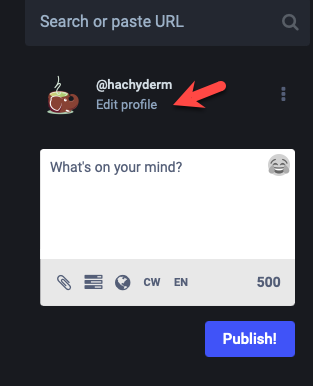
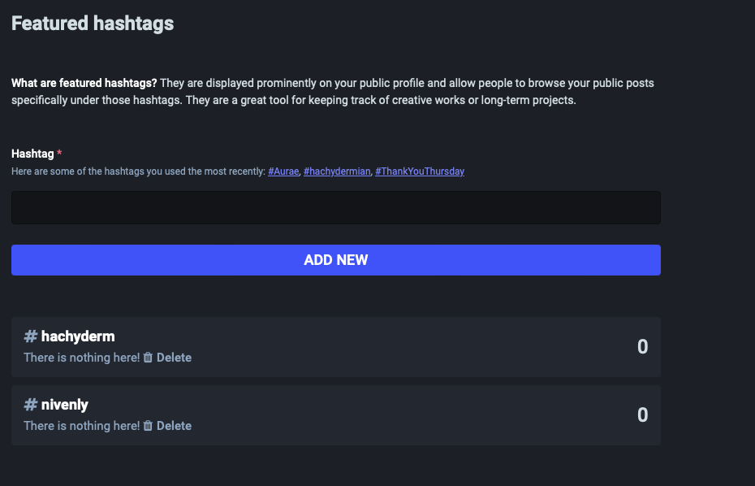
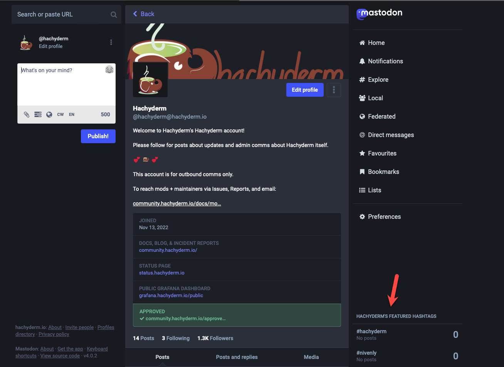
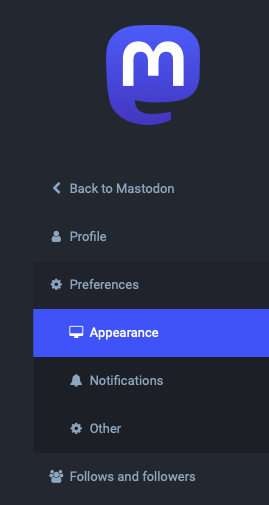
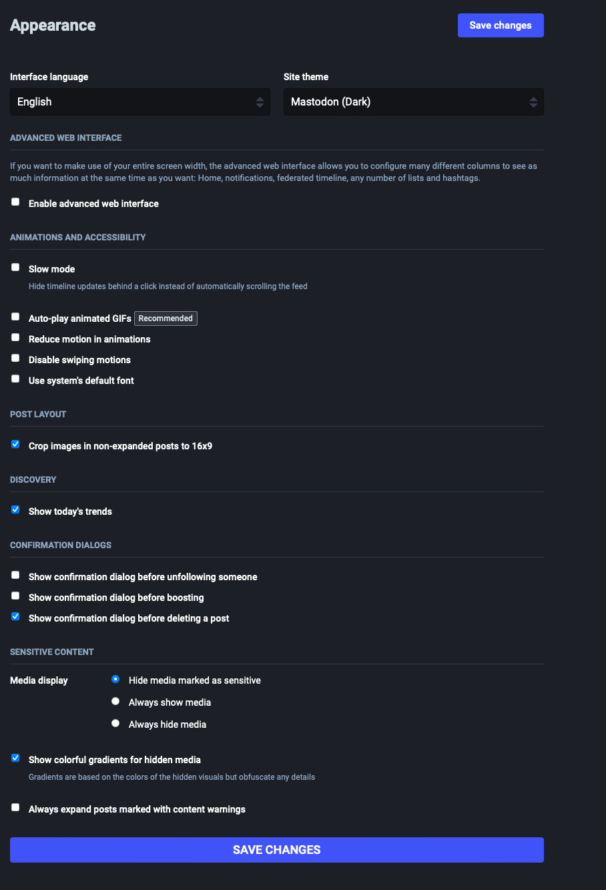
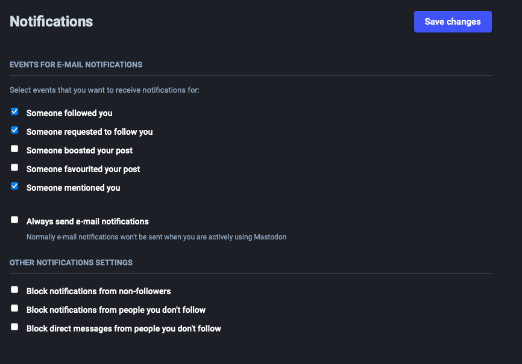
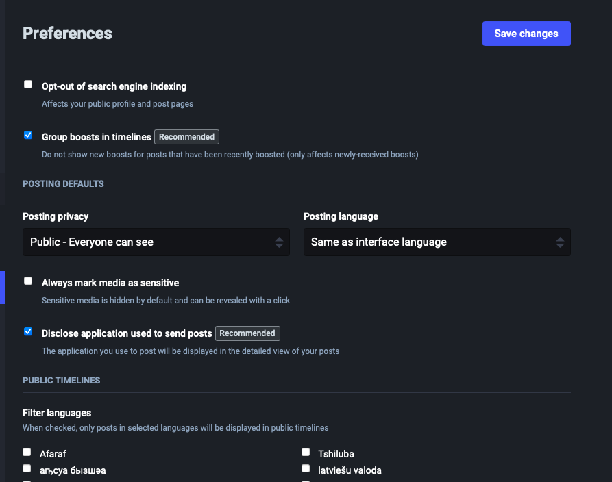

{}
This page documents features and processes maintained by Mastodon. For
issues related to these features and/or processes, please reach out to the Mastodon team
directly on [the Mastodon project's GitHub](https://github.com/mastodon/mastodon).

For issues with this doc page itself, please reach out to us on
[Hachyderm's Community Issue tracker](https://github.com/hachyderm/community/issues).
{}

## Overview <!-- omit from toc -->

This documentation page covers the customization options available to you via Profile and Preferences settings.
The majority of the article length is due to screenshots that show the main view for each settings page. All of
the settings shown in the screenshots are the default settings, done for the purposes of this article. This document
only provides explanation text where the feature being enabled / disabled is not self-descriptive.

- [Profile Settings](#profile-settings)
  - [Appearance](#appearance)
  - [Featured Hashtags](#featured-hashtags)
- [Preferences Settings](#preferences-settings)
  - [Appearance](#appearance-1)
  - [Notifications](#notifications)
  - [Other](#other)

## Profile Settings

In order to edit your profile settings, you can click the "Edit Profile" text beneath your handle on
the left side, like so:

Alternatively you can go to the [settings/profile](https://hachyderm.io/settings/profile) endpoint directly in your browser.

### Appearance

When you go to [settings/profile](https://hachyderm.io/settings/profile), by default you will be taken to
the settings for Profile <i class="fas fa-arrow-right"></i> Appearance:

To recap the above, here is where you can:

* Set your display name
* Write your bio
* Upload your header and avatar images
* Enable or disable follow requests 
  * Disabled by default. Accounts will be able to follow your account without explicit approval. 
    When enabled, you will be prompted to approve or deny follow requests.
* Set if you're a bot 
  * Disabled by default. When enabled, your account displays with the word "bot" next to your
    handle and display handle on your profile. There are no other changes to your account.
* Suggest your account to others 
  * Disabled by default. When enabled, your account will be recommended to other accounts as
    an account to follow.
* Hide your social graph 
  * Disabled by default. When enabled, other users will not be able to see who you follow or who follows you.
* Write your profile metadata
  * This allows you to input information that is rendered like "key: value" tags. 
    Relevantly, when you add URLs these are also where the text area highlights green when [verified](/docs/mastodon/user/verification).
* Migrate to a different account or link to an account you're migrating from
* Delete your account 
  * :warning: Account deletion works differently than account suspension. When you delete your account
    your data is deleted **_immediately_** and not after a 30 day window. Also, there are inconsistent
    reports when deleted accounts are resurrected as they may not federate correctly depending on how
    servers remote to that account update their information about the account no longer being deleted (or not).

### Featured Hashtags

Featured hashtags are your ability to direct which hashtags appear on your main view. They are configured by
the Featured Hashtags settings located on the nav menu underneath Profile <i class="fas fa-arrow-right"></i> Appearance.
This page can also be accessed directly via [settings/featured_tags](https://hachyderm.io/settings/featured_tags).

When you enter hashtags to feature on your main view, they appear in the lower right:

Note in this case the descriptive text "Hachyderm's Featured Hashtags" refers to Hachyderm as the account display handle and not
Hachyderm at the instance-level.

## Preferences Settings

The Preferences settings are located immediately under the Profile settings in the left navigation menu.

### Appearance

When selected, the Appearance settings (not to be confused with the above) display by default. This page can
also be accessed via [settings/preferences/appearance](https://hachyderm.io/settings/preferences/appearance).

To recap the above, here is where you can:

* Set your interface language
* Set your site theme (light or dark)
* Enable the advanced web interface
  * Disabled by default. This allows you to pin and view multiple columns. Please see the
    [Mastodon documentation about user preferences](https://docs.joinmastodon.org/user/preferences/)
    for more detail.
* Enable Slow mode
  * This stops the timeline view from refreshing automatically.
* Enable Auto-play animated GIFs
* Set to reduce motion in animations 
  * This is specific to reducing the motion of animated GIFs. <!-- FIXME: need to test what this means. Slower? Only loops once? -->
* Disable swiping motions
  * This is specific to using browsers with devices that have a swiping feature. When enabled, it stops
    you from accidentally switching timelines when using a swipe motion to "go back".
* Use the system font
  * When enabled, this uses Mastodon's default font (Roboto).
* Enable crop image size
* Show trends
* Enable the confirmation before following someone
* Enable the confirmation before boosting
* Enable the confirmation before deleting a post 
* Set how you want media to display
  * Default is "hide media marked as sensitive". Specifically allows you to either always show media, always hide media, or hide media only where the poster marked that media as sensitive.
* Enable if you want a color gradient for hidden media
* Enable if you want posts expanded with content warnings

### Notifications

Accessible via Preferences <i class="fas fa-arrow-right"></i> Notifications. Can also be directly accessed via
[settings/preferences/notifications](https://hachyderm.io/settings/preferences/notifications). These preferences
are separate from the Notifications preferences you can make when viewing in the Timeline view.

To recap the above, here is where you can:

* Enable or disable email notifications for:
  * Someone following you
  * Someone requesting to follow you
  * Someone boosting you
  * Someone favoriting a post
  * Someone mentioning you
* Override the above, in cases where:
  * The account is not following you
  * You are not following the account
* Block direct messages from people you don't follow

For the two features in the "override" section above, this means if you have enabled notifications for boosts and
also enabled "block notifications from non-followers", then you will only see notifications for when your followers
boost you.

### Other

Located at via Preferences <i class="fas fa-arrow-right"></i> Other or [settings/preferences/other](https://hachyderm.io/settings/preferences/other).

To recap the above, here is where you can:

* Opt-out of search engine indexing
* Group boosts in timelines
  * Enabled by default. When enabled, if multiple people have boosted the same post in a short timeframe you will
    only one of the boosts rather than all of the boosts separately.
* Set your default posting privacy
  * Posting privacy options are: 
    Public 
    Unlisted 
    Private
* Set your default posting language
* Set if you want all of your media marked as sensitive
* Disclose what application you use to post from
* Filter languages
  * Note not all languages captured in screenshot, due to length.