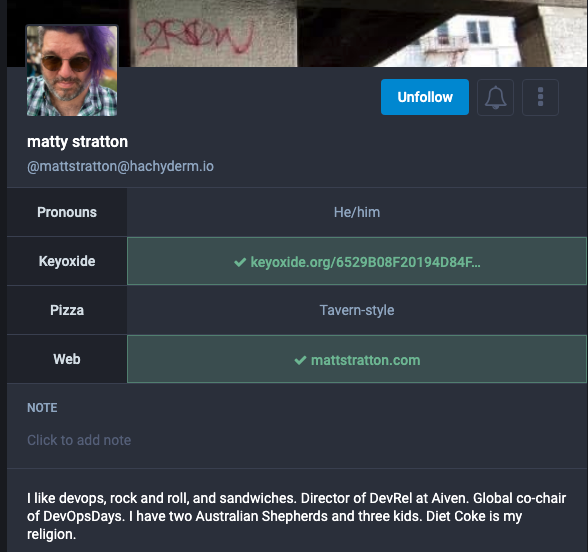
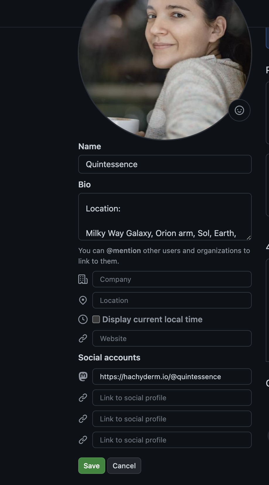

{}
This page documents a process maintained by Mastodon. For
verification failures, please reach out to the Mastodon team
directly on [the Mastodon project's GitHub](https://github.com/mastodon/mastodon).

For issues with this doc page itself, please reach out to us on
[Hachyderm's Community Issue tracker](https://github.com/hachyderm/community/issues).
{}

## What is verification?

Verification on Mastodon works less like Twitter and more like an identity
service. That is, you do not need to prove your association with your own
brand to an entity or to pay a fee, you are only showing that you are the owner of one
(or more) domains or accounts on separate services to substantiate your digital
identity.

Here's what it looks like when a profile has verified via their GitHub
identity:


GitHub shows as verified with a green checkmark and complete URL,
including username / handle.

### What domains or accounts can you verify?

You can verify via:

* Any domain that you can edit pages for
* Any online service that recognizes, supplies, or allows you to
  supply the "rel me" attribute (see below).

## How to verify

### Verifying with domains

In general, when you verify you will do so by using the following HTML on the
page you are editing, like a personal site or blog:

```html
<a rel="me" href="https://hachyderm.io/@username">Hachyderm</a>
```

If you would like to avoid using a visible link, like the above, you can
also put the following in the page headers:

```html
<link rel="me" href="https://hachyderm.io/@username">
```

After doing either of the above, you will need to add the URL of the site
to your Hachyderm / Mastodon profile. You will do that by:

1. Go to Edit Profile
2. In one of the four fields of Profile Metadata, add the URL of the
   destination you are verifying
3. Save changes

Here is an example profile with two separate sources of identity
verification:



<small>Screenshot of Hachyderm user profile taken with permission.</small>

### Verifying with services

We will add more services as requested by the Community either by
[creating an issue on our Community Issue Tracker](https://github.com/hachyderm/community/issues) or via a
direct [pull request on the Community repo](https://github.com/hachyderm/community/pulls).

Instructions for current, commonly requested, services are below.

As with the verification process itself: **when verifying with a
service, that service is responsible for assisting with errors or
issues with verification. If you experience issues with the
verification process, please reach out to the relevant service for
assistance.**

#### GitHub

In early 2023 GitHub announced support for multiple social URLs,
including adding support for Mastodon specifically. In order to
verify via GitHub:

1. Go to your GitHub profile page and click "Edit"
1. Provide your Hachyderm account URL of the format `https://hachyderm.io/@USERNAME`
1. Click "Save"

Once you have saved, your GitHub profile should now render your
Mastodon account in the format `@USERNAME@hachyderm.io`.

**Visually**

When you edit, it will look like this:



Once saved, your Hachyderm account will look like this:


